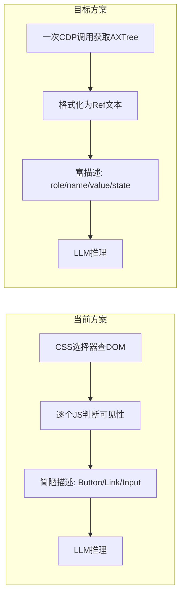
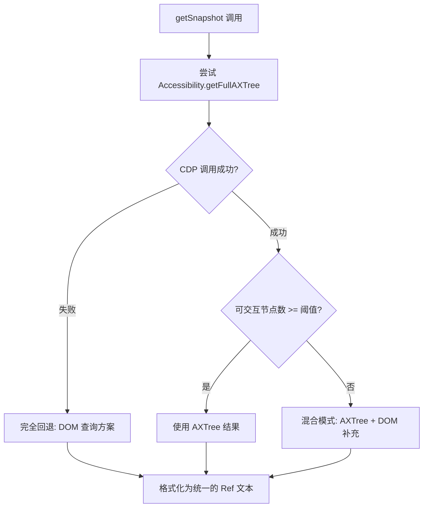

# BrowserUse 工具升级计划

## 现状分析

当前使用的 `github.com/cloudwego/eino-ext/components/tool/browseruse` 底层已经是 **chromedp（CDP 方案）**，但存在以下性能瓶颈：

### 当前实现的慢点在哪

1. **元素发现方式低效**：`updateElements()` 用 CSS 选择器 `a, button, input, select, textarea` 查询 DOM，然后逐个节点调用 JS 判断可见性（`calculateVisible`），N 个元素就是 N 次 JS Evaluate 往返
2. **截图开销大**：`GetCurrentState()` 每次都截图 + base64 编码，但 `Execute()` 并不使用截图，截图主要是给外部调用的状态查询用
3. **标注注入开销**：`GetCurrentState()` 注入 DOM 标记（红色边框 + 序号）后再截图，JS 注入本身耗时
4. **每步都有硬编码等待**：`click_element` 后有 `Sleep(1*time.Second)` 固定等待
5. **信息密度低**：返回给 LLM 的元素描述很简陋（如 `Link: https://...`、`Button:` ），LLM 难以精确判断该点哪个

### 目标方案：Accessibility Tree Snapshot + Ref

参考 OpenClaw 的做法，核心改变是把"逐个查 DOM 元素"改为"一次性获取整个页面的无障碍树"：




## 改造方案

### 核心思路：自建 browser_use 工具，不再依赖 eino-ext/browseruse

eino-ext 的 browseruse 封装层太薄，改造空间有限。建议**自建一个新的 browser 工具**，直接使用 chromedp，保留 eino 的 `tool.BaseTool` 接口不变。

### Phase 1：新建基于 AXTree 的浏览器工具

**新文件**：`[internal/eino/tools/browser.go](internal/eino/tools/browser.go)`

核心改造点：

#### 1. 用 CDP `Accessibility.getFullAXTree` 替代 DOM 查询

```go
// 一次 CDP 调用获取整个无障碍树
import "github.com/chromedp/cdproto/accessibility"

func (b *browserTool) getSnapshot(ctx context.Context) (string, error) {
    var nodes []*accessibility.AXNode
    err := chromedp.Run(ctx, chromedp.ActionFunc(func(ctx context.Context) error {
        var err error
        nodes, err = accessibility.GetFullAXTree().Do(ctx)
        return err
    }))
    // 过滤并格式化为带 ref 编号的文本
    return formatAXTreeAsRefText(nodes), nil
}
```

输出格式类似：

```
[1] button "登录" (enabled)
[2] textbox "用户名" value="" (focused)
[3] textbox "密码" value="" (password)
[4] link "忘记密码？" href="/forgot"
[5] navigation "主菜单"
  [6] link "首页" href="/"
  [7] link "设置" href="/settings"
```

#### 2. Ref 编号到 AXNode 的映射

维护一个 `map[int]*accessibility.AXNode`，Agent 说 `click 2` 时，通过 AXNode 的 `backendDOMNodeId` 反查 DOM 节点，再用 CDP 执行操作。

```go
type browserTool struct {
    // ...
    refMap   map[int]accessibility.AXNodeID  // ref -> AXNode
    nodeMap  map[accessibility.AXNodeID]*accessibility.AXNode
}
```

#### 3. 新的 Action 设计

保持与现有接口兼容，但增加 `snapshot` action 并优化交互：


| Action            | 说明                 | 变化                        |
| ----------------- | ------------------ | ------------------------- |
| `snapshot`        | **新增** - 获取页面结构化文本 | 替代截图                      |
| `go_to_url`       | 导航后自动返回 snapshot   | 不再截图                      |
| `click`           | 通过 ref 点击          | 用 AXNode backendDOMNodeId |
| `type`            | 通过 ref 输入文本        | 同上                        |
| `scroll_down/up`  | 滚动后自动返回新 snapshot  | 不变                        |
| `extract_content` | 保留                 | 不变                        |
| `web_search`      | 保留                 | 不变                        |
| `wait`            | 保留                 | 去掉硬编码 sleep               |
| Tab 操作            | 保留                 | 不变                        |


#### 4. 去掉硬编码等待

click 后不再 `Sleep(1s)`，改为等待页面稳定：

```go
// 等待网络空闲或 DOM 稳定
chromedp.WaitReady("body", chromedp.ByQuery)
```

### Phase 2：集成与切换

修改 `[internal/eino/tools/registry.go](internal/eino/tools/registry.go)` 和 `[internal/eino/tools/config.go](internal/eino/tools/config.go)`：

- 新工具 ID：仍使用 `browser_use`（对 LLM 透明）
- 工厂函数指向新实现
- 配置项新增：`Headless bool`、`BrowserPath string`（可选，自动检测 Chrome/Edge）

### Phase 3：自动检测系统浏览器

Windows 上自动检测顺序：

1. Chrome（`Program Files/Google/Chrome/...`）
2. Edge（`Program Files (x86)/Microsoft/Edge/...`，Windows 预装）
3. Brave
4. 用户自定义路径

这样用户**零配置即可使用**。

### Phase 4：优化 Snapshot 输出

- **过滤无意义节点**：跳过 `role=generic`、`role=none`、不可见节点
- **控制深度**：避免超大页面生成过长文本
- **紧凑模式**：只输出可交互元素（类似 OpenClaw 的 `--interactive`）
- **字符数限制**：超长页面截断 + 提示 Agent 可以滚动查看更多

## 文件变更清单


| 文件                                        | 操作     | 说明                            |
| ----------------------------------------- | ------ | ----------------------------- |
| `internal/eino/tools/browser.go`          | **新建** | 新的浏览器工具实现                     |
| `internal/eino/tools/browser_detect.go`   | **新建** | 系统浏览器自动检测                     |
| `internal/eino/tools/browser_snapshot.go` | **新建** | AXTree 获取与格式化                 |
| `internal/eino/tools/browseruse.go`       | 修改     | 改为调用新实现（或废弃）                  |
| `internal/eino/tools/registry.go`         | 修改     | 工厂函数指向新实现                     |
| `internal/eino/tools/config.go`           | 修改     | 新增浏览器配置项                      |
| `internal/eino/agent/agent.go`            | 小改     | 适配新工具的配置注入                    |
| `go.mod`                                  | 可能修改   | 如果可以移除 eino-ext/browseruse 依赖 |


## AXTree 回退到 DOM 查询的策略

AXTree 并非万能，以下场景需要回退到 DOM 查询作为补充：

### 何时触发回退




### 三种模式详解

#### 模式 1：纯 AXTree（默认路径，最快）

正常情况下 AXTree 返回的节点足够丰富，直接使用。判断标准：**可交互节点数（button/link/textbox/checkbox 等）>= 3 个**，即认为 AXTree 信息充足。

#### 模式 2：混合模式（AXTree 不完整时）

部分网站的无障碍标注差（如纯 `<div onclick>` 做的按钮、Canvas 应用、某些 SPA），AXTree 返回的可交互节点极少。此时：

1. 先用 AXTree 的结果作为基础
2. 再用 DOM 查询补充：`document.querySelectorAll('[onclick], [role], a, button, input, select, textarea, [tabindex]')`
3. 对 DOM 补充的元素，通过 JS 一次性批量获取描述信息（而非逐个查询，避免当前方案 N 次往返的问题）：

```go
// 一次 JS Evaluate 批量获取所有补充元素信息
script := `(() => {
    const els = document.querySelectorAll('[onclick], [role], a, button, input, select, textarea, [tabindex]');
    return Array.from(els).filter(el => {
        const rect = el.getBoundingClientRect();
        const style = getComputedStyle(el);
        return rect.width > 0 && rect.height > 0 
            && style.display !== 'none' 
            && style.visibility !== 'hidden';
    }).map((el, i) => ({
        tag: el.tagName,
        role: el.getAttribute('role') || '',
        text: (el.textContent || '').trim().slice(0, 80),
        type: el.getAttribute('type') || '',
        placeholder: el.getAttribute('placeholder') || '',
        href: el.getAttribute('href') || '',
        xpath: getXPath(el)
    }));
})()`
```

1. 合并 AXTree 和 DOM 补充结果，去重后统一编号

#### 模式 3：完全回退（AXTree CDP 调用失败时）

极端情况下（旧版 Chrome 不支持 `Accessibility.getFullAXTree`、或 CDP 连接异常），完全回退到 DOM 查询方案。此方案与当前 eino-ext/browseruse 的逻辑类似，但做了批量化优化（一次 JS Evaluate 替代 N 次往返）。

### 输出格式统一

无论哪种模式，最终输出给 LLM 的格式完全一致：

```
[1] button "登录" (enabled)
[2] textbox "用户名" value="" (focused)
[3] link "忘记密码？" href="/forgot"
```

Agent 无需感知底层用了哪种模式，交互方式不变。

### 实现位置

回退逻辑统一放在 `internal/eino/tools/browser_snapshot.go` 中：

```go
// getSnapshot 尝试 AXTree，必要时回退
func (b *browserTool) getSnapshot(ctx context.Context) (*snapshotResult, error) {
    // 1. 尝试 AXTree
    axNodes, err := b.getAXTree(ctx)
    if err != nil {
        // 模式 3：完全回退到 DOM 查询
        return b.getDOMSnapshot(ctx)
    }
    
    interactive := filterInteractive(axNodes)
    if len(interactive) >= minInteractiveThreshold {
        // 模式 1：纯 AXTree
        return formatAXSnapshot(axNodes, interactive)
    }
    
    // 模式 2：混合模式
    domElements, _ := b.getDOMElements(ctx)
    merged := mergeAndDedup(axNodes, domElements)
    return formatMergedSnapshot(merged)
}
```

## 风险与注意事项

- **chromedp 的 `accessibility.GetFullAXTree` 性能**：大页面可能返回数千节点，需要合理过滤和截断
- **向后兼容**：工具名和基本 action 保持不变，对已有的 system prompt 无影响
- **headless 模式**：保持默认 headless，但支持配置为有头模式（调试用）
- **混合模式去重**：AXTree 节点和 DOM 元素可能指向同一个元素，需通过 backendDOMNodeId 或 XPath 去重

