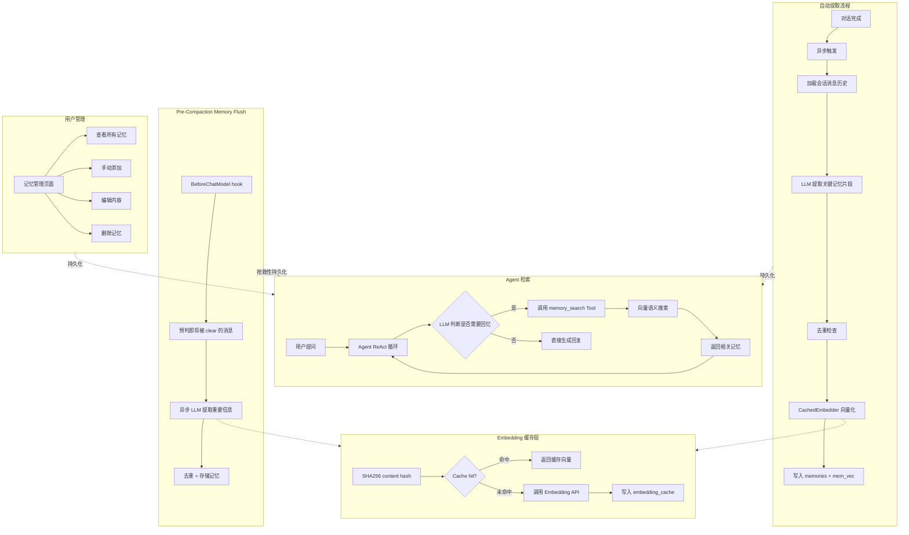
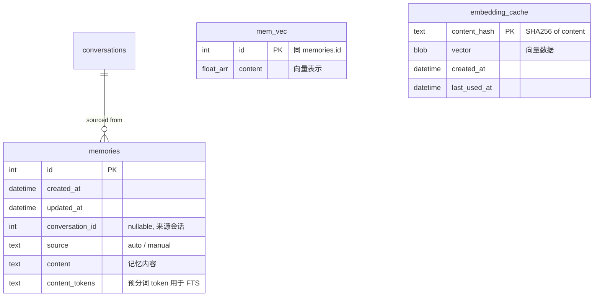
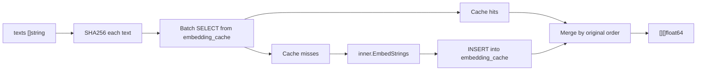
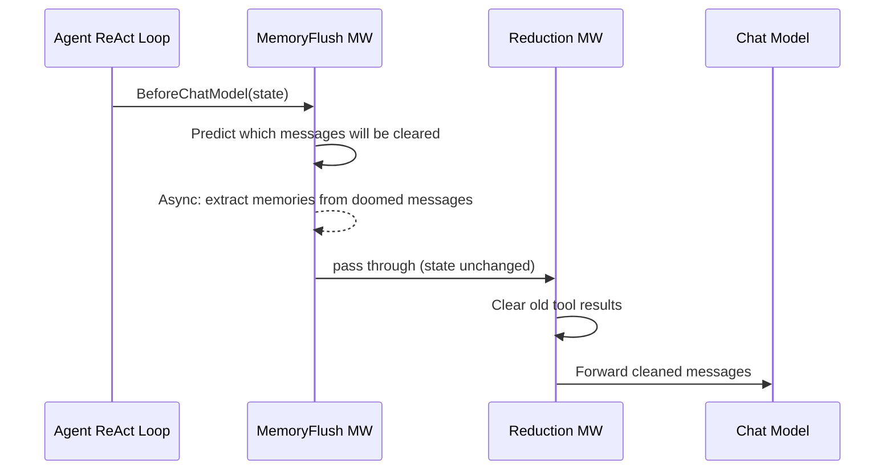

# WillClaw 长期记忆（Long-Term Memory）方案

## 核心理念

- **全局记忆**：所有智能体共享一个记忆池，记忆不按 Agent 隔离
- **自动提取**：系统在对话完成后自动用 LLM 提取关键记忆，无需用户手动操作
- **用户可管理**：用户可在独立的「记忆管理」页面查看、编辑、删除、手动添加记忆
- **独立入口**：记忆管理在侧边栏知识库下方，作为与知识库平级的独立模块
- **Embedding 缓存**：基于内容哈希的全局向量缓存，避免对相同文本重复调用 Embedding API，记忆和知识库共用
- **Pre-Compaction Flush**：在 reduction middleware 清除旧消息前，抢救性提取其中的重要信息写入长期记忆

---

## 架构设计

### 整体流程




### 数据模型




**字段说明：**

- 没有 `agent_id` — 记忆是全局的，所有智能体共享
- `conversation_id`（可空）— 自动提取的记忆关联来源会话，手动添加的为 NULL
- `source` — 区分 `auto`（系统自动提取）和 `manual`（用户手动添加），方便 UI 展示和过滤
- `embedding_cache` — 全局 Embedding 缓存，以内容 SHA256 为键，避免重复 Embedding API 调用（记忆 + 知识库共用）

---

## 实现计划

### 第一步：数据库迁移

新增 `internal/sqlite/migrations/202602071000_create_memories_table.go`：

- `memories` 表：`id`、`created_at`、`updated_at`、`conversation_id`（nullable）、`source`、`content`、`content_tokens`
- `mem_vec` 虚拟表（sqlite-vec）：维度与全局 Embedding 配置一致
- `mem_fts` 虚拟表（FTS5）：contentless 模式，索引 `content_tokens`
- `embedding_cache` 表：全局 Embedding 向量缓存（记忆 + 知识库共用）
- 触发器：INSERT/DELETE/UPDATE 时同步 `mem_fts`（参考 `doc_fts` 的触发器模式）
- 索引：`conversation_id`、`source`

`embedding_cache` 表 DDL：

```sql
CREATE TABLE IF NOT EXISTS embedding_cache (
    content_hash TEXT PRIMARY KEY,    -- SHA256(content text)
    vector       BLOB NOT NULL,       -- 序列化后的 []float64
    dimension    INTEGER NOT NULL,    -- 向量维度（用于校验，配置变更时可整体失效）
    created_at   DATETIME NOT NULL DEFAULT CURRENT_TIMESTAMP,
    last_used_at DATETIME NOT NULL DEFAULT CURRENT_TIMESTAMP
);
CREATE INDEX idx_embedding_cache_last_used ON embedding_cache(last_used_at);
```

设计要点：

- `content_hash` 用 SHA256 哈希文本内容，同一文本永远得到同一 key
- `dimension` 记录向量维度，当用户切换 Embedding 模型导致维度变化时可批量清除旧缓存
- `last_used_at` 用于 LRU 淘汰策略——缓存命中时更新此字段
- 该缓存是全局的，记忆系统和知识库系统均可复用

### 第二步：Embedding 缓存层

新增 `internal/eino/embedding/cache.go`：

```go
// CachedEmbedder wraps an Embedder with a content-hash based cache backed by SQLite.
// It avoids redundant Embedding API calls for identical text content.
type CachedEmbedder struct {
    inner     embedding.Embedder
    db        *bun.DB
    dimension int // expected dimension; cache entries with different dimension are treated as stale
}

func NewCachedEmbedder(inner embedding.Embedder, db *bun.DB, dimension int) embedding.Embedder

// EmbedStrings implements embedding.Embedder.
// For each input text:
//   1. Compute SHA256(text) as cache key
//   2. Look up embedding_cache: if hit and dimension matches, use cached vector and update last_used_at
//   3. If miss, collect into a "to-embed" batch
// After batch embedding the misses via inner.EmbedStrings:
//   4. Write new entries into embedding_cache
//   5. Merge cached + fresh results back into the original order
func (c *CachedEmbedder) EmbedStrings(ctx context.Context, texts []string, opts ...embedding.Option) ([][]float64, error)
```

**工作流程图：**




**关键设计：**

- **透明包装**：`CachedEmbedder` 实现 `embedding.Embedder` 接口，对外表现与原始 Embedder 完全一致，可直接替换
- **批量查询**：一次 SELECT 查询所有 cache key，而不是逐条查
- **维度校验**：缓存命中时检查 `dimension` 是否匹配当前配置，不匹配则视为 miss（模型切换后自动失效）
- **LRU 淘汰**：命中时更新 `last_used_at`；可在 bootstrap 中定期清除过期缓存（如 30 天未使用的条目）
- **注入位置**：在 `internal/eino/embedding/factory.go` 的 `NewEmbedder` 返回前包装，或在 MemoryService/DocumentService 初始化时包装

**集成方式（在 factory.go 中）：**

```go
// NewEmbedder 修改：新增 db 和 dimension 参数，返回时自动包装缓存层
func NewEmbedder(ctx context.Context, cfg *ProviderConfig) (embedding.Embedder, error) {
    // ... 原有逻辑创建 emb ...
    emb = WrapWithBatchLimit(emb, DefaultBatchSize)
    // 如果提供了 db，包装缓存层
    // Note: 也可以在调用方（MemoryService / processor）自行包装
    return emb, nil
}
```

推荐在**调用方**包装（而非改动 factory），这样更灵活：

```go
// MemoryService 初始化时
cachedEmb := embedding.NewCachedEmbedder(rawEmb, db, dimension)

// processor.go 初始化时（知识库也受益）
cachedEmb := embedding.NewCachedEmbedder(rawEmb, db, dimension)
```

### 第三步：MemoryService 后端服务

新增 `internal/services/memory/service.go` + `model.go`：

```go
type MemoryService struct {
    app *application.App
}

// === 暴露给前端的 Wails 绑定 API ===

// ListMemories 列出所有记忆（支持分页/搜索，前端记忆管理页面使用）
func (s *MemoryService) ListMemories(input ListMemoriesInput) (*ListMemoriesResult, error)

// CreateMemory 手动添加一条记忆（source = "manual"）
func (s *MemoryService) CreateMemory(input CreateMemoryInput) (*Memory, error)

// UpdateMemory 编辑记忆内容（重新向量化）
func (s *MemoryService) UpdateMemory(id int64, input UpdateMemoryInput) (*Memory, error)

// DeleteMemory 删除一条记忆（级联清理 mem_vec + mem_fts）
func (s *MemoryService) DeleteMemory(id int64) error

// DeleteAllMemories 清空所有记忆
func (s *MemoryService) DeleteAllMemories() error

// GetMemoryStats 获取记忆统计信息（总数、自动/手动分布等，页面顶部展示）
func (s *MemoryService) GetMemoryStats() (*MemoryStats, error)

// === 内部 API（不暴露给前端）===

// ExtractAndStore 从会话中自动提取并存储记忆（由 ChatService 异步调用）
func (s *MemoryService) ExtractAndStore(ctx context.Context, input ExtractInput) error

// Search 向量语义搜索（供 Agent Tool 调用）
func (s *MemoryService) Search(ctx context.Context, input SearchInput) ([]MemoryResult, error)
```

**关键行为：**

- `CreateMemory`：写入 `memories`（source="manual"），异步调用 Embedding 向量化写入 `mem_vec`；Embedding 未配置时仅存文本不阻塞
- `UpdateMemory`：更新 content，重新向量化替换 `mem_vec` 中的旧向量
- `DeleteMemory`：级联删除 `mem_vec` 和 `mem_fts`
- `ExtractAndStore`（自动提取核心逻辑）：
  1. 加载会话消息历史
  2. 调用 LLM 提取关键信息（用户偏好、关键事实、重要决策等），返回 JSON 数组
  3. 对每条候选记忆，用向量相似度与已有记忆比对去重（余弦相似度 > 0.9 则跳过）
  4. 新记忆写入 `memories`（source="auto", conversation_id=来源会话），向量化写入 `mem_vec`
- `Search`：向量搜索 `mem_vec` + 全文搜索 `mem_fts`，RRF 融合排序（复用 [retrieval/service.go](internal/services/retrieval/service.go) 的模式）

### 第四步：自动提取触发机制

修改 [service.go](internal/services/chat/service.go)：

在 `runGenerationWithExistingHistory` 生成完成后，启动异步 goroutine：

```
生成完成 → go func() {
    1. 计算当前会话消息总轮次
    2. 检查是否满足提取条件（如每 10 轮提取一次，用 conversation_id 判断上次提取位置）
    3. 满足条件 → 调用 MemoryService.ExtractAndStore
}()
```

**触发条件：**

- 每个会话每累计 N 轮新对话触发一次（N 可配置，默认 10）
- 记录上次提取时的消息 ID，下次只提取增量部分
- 完全异步，不阻塞用户对话

### 第五步：Pre-Compaction Memory Flush

**核心思想：** Eino ADK 的 reduction middleware 会在 `BeforeChatModel` 阶段清除旧的工具结果（替换为 `[Old tool result content cleared]`），这些被清除的内容中可能包含有价值的信息。Pre-Compaction Memory Flush 在 clearing 发生前捕获即将被清除的消息内容，异步提取重要记忆。

**实现方式：** 在 `BuildMiddlewares` 中，在 reduction middleware **之前**注册一个自定义 `BeforeChatModel` 中间件。

修改 [agent.go](internal/eino/agent/agent.go) 的 `BuildMiddlewares`：

```go
// 新增：Memory Flush middleware — 在 reduction clearing 之前捕获即将被清除的消息
memFlushMw := adk.AgentMiddleware{
    BeforeChatModel: func(ctx context.Context, state *adk.ChatModelAgentState) error {
        // 1. 用与 reduction 相同的阈值逻辑"预判"哪些消息即将被 clear
        //    （复用 reduction 的 token 计算逻辑：toolResultTokenThreshold=20000, keepRecentTokens=40000）
        // 2. 收集这些即将被清除的 Tool result 消息内容
        // 3. 如果存在有价值的内容，异步 goroutine 调用 MemoryService.FlushBeforeClear
        // 4. 不修改 state，不阻塞 — 仅"旁观"并异步保存
        return nil
    },
}
```

中间件注册顺序变为：

1. Filesystem middleware
2. **Memory Flush middleware** (新增)
3. Reduction middleware
4. Skill middleware

`MemoryService.FlushBeforeClear` 方法：

```go
// FlushBeforeClear extracts important information from messages that are about to be
// cleared by the reduction middleware. Called asynchronously before clearing happens.
func (s *MemoryService) FlushBeforeClear(ctx context.Context, messages []*schema.Message) error {
    // 1. Filter: only process tool result messages with substantial content
    //    (skip messages already cleared, skip very short messages)
    // 2. Concatenate the filtered content into a summary prompt
    // 3. Call LLM to extract key facts/memories (same extraction prompt as ExtractAndStore)
    // 4. Deduplicate against existing memories (vector similarity > 0.9 → skip)
    // 5. Store new memories (source="auto", conversation_id from context if available)
}
```

**关键设计：**

- **时机精准**：Memory Flush 中间件在 reduction 之前执行，此时消息内容尚未被清除
- **只旁观不修改**：中间件不修改 `state.Messages`，仅读取并异步处理
- **防重复执行**：使用 `context.Value` 或消息 ID 标记已 flush 过的消息段，避免同一会话多轮对话重复提取
- **与自动提取的关系**：Memory Flush 是"抢救性"提取（clearing 前），自动提取是"定期性"提取（每 N 轮）；两者共用去重逻辑，不会产生重复记忆
- **MemoryService 注入到 middleware**：`BuildMiddlewares` 需要接收 `MemoryService` 参数（或通过 `application.App` 获取）

**流程图：**




### 第六步：memory_search Agent Tool

新增 `internal/eino/tools/memory_search.go`：

- 工具名：`memory_search`
- 工具描述：「搜索用户的长期记忆，包含用户的偏好、个人信息、过往对话中的关键事实和决策。当需要了解用户背景、偏好或过往约定时使用此工具。」
- 输入参数：`query string`
- 输出：格式化的记忆列表（content + 来源 + 创建时间）
- 全局共享，不绑定 agentID

### 第七步：Tool 注入到 Agent

修改 [service.go](internal/services/chat/service.go) 的 `runGenerationWithExistingHistory`（L611-633 区域）：

- 查询全局记忆是否存在（`SELECT COUNT(*) FROM memories`）
- 如果有记忆 → 创建 `MemorySearchTool` 加入 `extraTools`，在 instruction 追加提示
- 如果无记忆 → 不注入（避免浪费工具 slot）

### 第八步：前端导航 — 新增 memory 模块

**修改 [navigation.ts](frontend/src/stores/navigation.ts)：**

- `NavModule` 类型新增 `'memory'`
- `moduleLabels` 新增 `memory: 'nav.memory'`
- `singleTabModules` 新增 `'memory'`（与知识库一样，单标签模块）

**修改 [SideNav.vue](frontend/src/components/layout/SideNav.vue)：**

- 在 `topNavItems` 数组中，知识库（`knowledge`）之后新增记忆导航项：

```ts
{
  key: 'memory',
  labelKey: 'nav.memory',
  icon: IconMemory,   // 新增 SVG 图标
}
```

- 侧边栏顺序：AI 助手 → 知识库 → 记忆 → 多问

**修改 [App.vue](frontend/src/App.vue)：**

- 模块到组件映射中新增 `memory: MemoryPage`

**新增图标：**

- `frontend/src/assets/icons/memory.svg` — 记忆模块图标（使用 currentColor）

### 第九步：记忆管理页面

新增 `frontend/src/pages/memory/MemoryPage.vue`，布局参考 `KnowledgePage.vue`：

**页面结构：**

```
+---------------------------------------------+
| 顶部区域                                      |
|  记忆管理             [+ 添加记忆] [清空全部]   |
|  共 42 条记忆（36 自动 / 6 手动）              |
+---------------------------------------------+
| 搜索框  [搜索记忆内容...]                      |
+---------------------------------------------+
| 记忆列表                                      |
|                                               |
| ┌─────────────────────────────────────────┐  |
| │ 用户正在开发一个叫 WillClaw 的 AI 助手应用  │  |
| │ 自动提取 · 来自「关于项目架构的讨论」· 2/7   │  |
| │                              [编辑] [删除] │  |
| └─────────────────────────────────────────┘  |
|                                               |
| ┌─────────────────────────────────────────┐  |
| │ 用户偏好简洁直接的回答风格                   │  |
| │ 手动添加 · 2/6                             │  |
| │                              [编辑] [删除] │  |
| └─────────────────────────────────────────┘  |
|                                               |
| ...更多记忆条目...                              |
+---------------------------------------------+
```

**功能：**

- **统计栏**：总数、自动/手动分布（调用 `GetMemoryStats`）
- **搜索**：按内容关键词过滤（前端过滤或调用后端 ListMemories 带搜索参数）
- **记忆列表**：每条记忆卡片显示内容、来源标签（自动/手动）、关联会话名（自动提取的）、创建时间、编辑/删除按钮
- **添加记忆**：点击按钮弹出输入框，输入内容后调用 `CreateMemory`
- **编辑**：点击编辑进入行内编辑模式，保存后调用 `UpdateMemory`
- **删除**：单条删除 + 「清空全部」按钮（带二次确认）
- **空状态**：无记忆时引导提示

**组件拆分（新增）：**

- `frontend/src/pages/memory/MemoryPage.vue` — 主页面
- `frontend/src/pages/memory/components/MemoryCard.vue` — 单条记忆卡片
- `frontend/src/pages/memory/components/CreateMemoryDialog.vue` — 添加记忆对话框

---

## 关键设计决策

- **全局记忆池**：不按 Agent 隔离，所有智能体共享。用户的偏好和个人信息天然跨智能体通用
- **自动提取 + 用户可管理**：系统自动从对话中提取，降低用户负担；用户随时可以在记忆管理页面审查、编辑、删除
- **去重机制**：自动提取时用向量相似度检查，避免重复记忆堆积
- **增量提取**：只处理上次提取后的新消息，避免重复调用 LLM
- **条件注入 Tool**：全局有记忆才注入 memory_search 工具
- **Embedding 容错**：Embedding 未配置时，记忆仍可保存（FTS 仍可用），不阻塞
- **独立页面模块**：记忆管理作为侧边栏独立入口，与知识库平级，符合功能重要性
- **Embedding 缓存透明包装**：`CachedEmbedder` 实现 `embedding.Embedder` 接口，调用方无感知；缓存基于 SHA256(content) 键，维度校验防止模型切换后使用旧向量
- **双重记忆提取保障**：定期自动提取（每 N 轮）+ Pre-Compaction Flush（clearing 前抢救）双管齐下，共用去重逻辑保证不重复
- **Memory Flush 不阻塞**：Flush 中间件仅旁观 state 并异步处理，不修改消息、不增加 LLM 调用延迟

---

## 涉及文件

**新增文件（后端）：**

- `internal/sqlite/migrations/202602071000_create_memories_table.go` — 数据库迁移（memories + mem_vec + mem_fts + embedding_cache）
- `internal/services/memory/service.go` — MemoryService（CRUD + 自动提取 + 搜索 + FlushBeforeClear）
- `internal/services/memory/model.go` — 数据模型
- `internal/eino/embedding/cache.go` — CachedEmbedder（Embedding 缓存层）
- `internal/eino/tools/memory_search.go` — memory_search Agent Tool

**新增文件（前端）：**

- `frontend/src/assets/icons/memory.svg` — 记忆模块图标
- `frontend/src/pages/memory/MemoryPage.vue` — 记忆管理主页面
- `frontend/src/pages/memory/components/MemoryCard.vue` — 记忆卡片组件
- `frontend/src/pages/memory/components/CreateMemoryDialog.vue` — 添加记忆对话框

**修改文件（后端）：**

- `internal/services/chat/service.go` — 条件注入 memory_search tool + 自动提取触发
- `internal/eino/agent/agent.go` — BuildMiddlewares 中新增 Memory Flush 中间件（在 reduction 前）
- `internal/bootstrap/app.go` — 注册 MemoryService
- `internal/eino/processor/processor.go` — （可选）用 CachedEmbedder 替换原始 Embedder，知识库也受益于缓存

**修改文件（前端）：**

- `frontend/src/stores/navigation.ts` — NavModule 新增 `'memory'`，加入 singleTabModules
- `frontend/src/components/layout/SideNav.vue` — topNavItems 新增记忆导航项
- `frontend/src/App.vue` — 模块映射新增 `memory: MemoryPage`
- i18n 文件 — 新增 `nav.memory` 翻译

