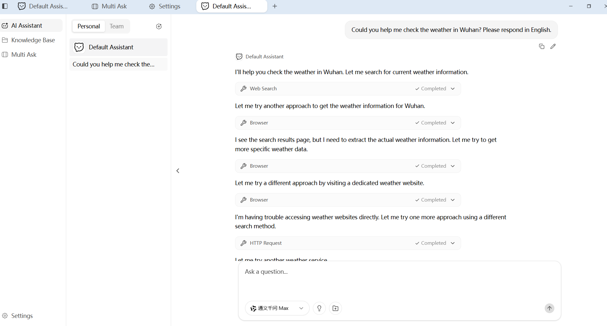
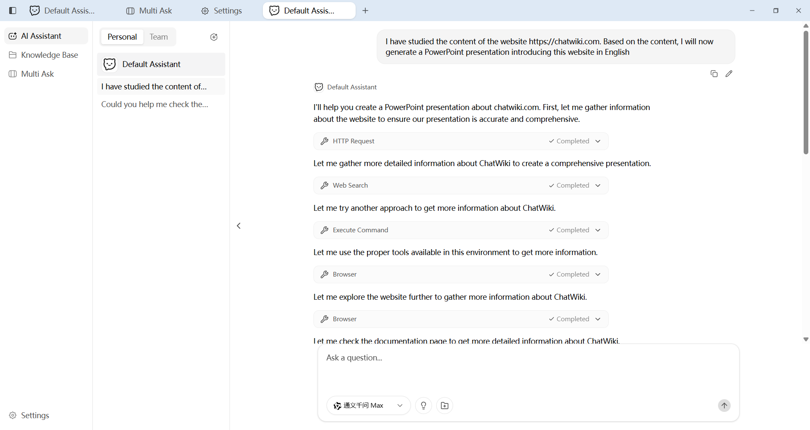
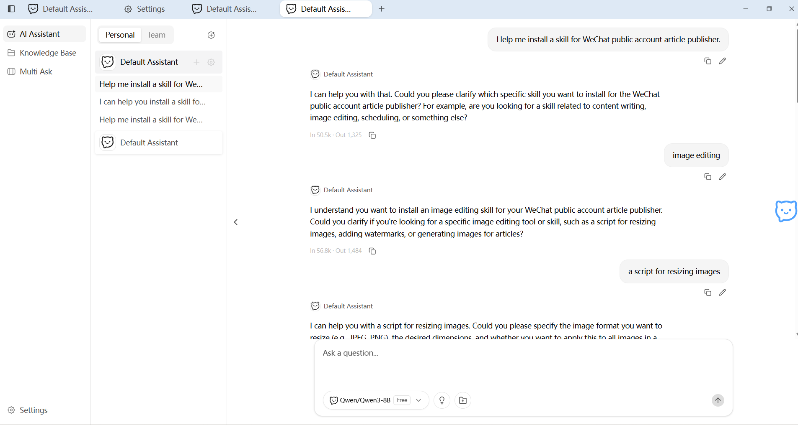
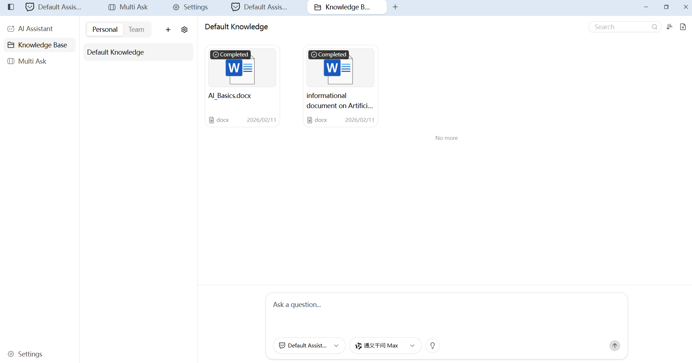
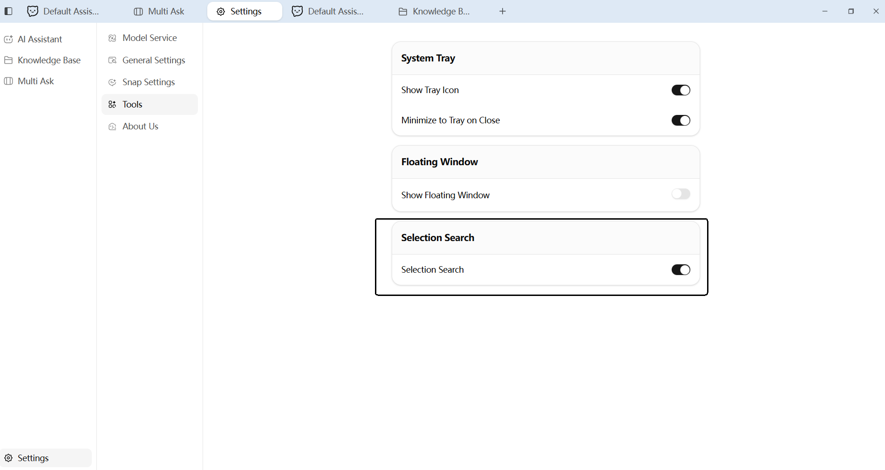
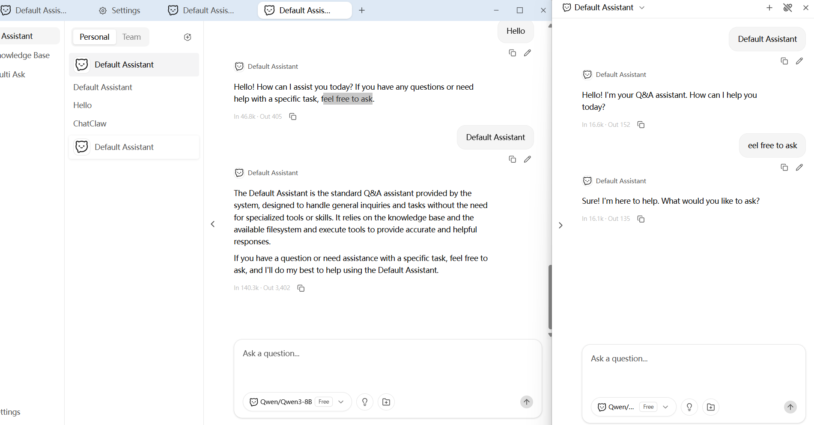
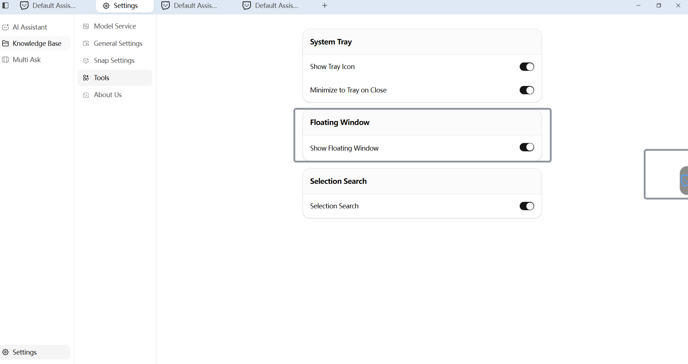

# ChatClaw

[中文文档](./README_zh-CN.md)

Desktop Knowledge Base Agent For All Tasks.

ChatClaw is a desktop AI tool that supports uploading knowledge bases to create custom robots for intelligent Q&A. Install and start using it immediately. Free AI models are provided.

## Previews

### AI Chatbot Assistant

Ask your AI assistant any question, and it will intelligently search your knowledge base to generate a relevant answer.



### PPT Quick Generate

Send a one-sentence command to the smart assistant to automatically create and generate a PowerPoint presentation.



### Skill Manager

Use a command to have the robot help you find installed features on your computer or install new extension plugins.



### Knowledge | Document Vectorization Storage

Upload your documents (e.g., TXT, PDF, Word, Excel, CSV, HTML, Markdown). The system will automatically parse, split, and convert them into vector embeddings, storing them in your private knowledge base for precise retrieval and utilization by the AI model.



### Text Selection for Instant Q&A

Select any text on your screen, and it will be automatically copied and filled into a floating quick-ask box. With one click, send it to the AI assistant for an immediate answer.





### Smart Snap Window

An intelligent assistant that can snap alongside other application windows. Quickly switch between differently configured AI assistants within it to ask questions. The bot generates answers based on your connected knowledge base and supports one-click sending of responses directly into your conversation.


### One Question, Multiple Answers: Compare with Ease

No need to repeat your query. Consult multiple "AI experts" simultaneously and view their responses side-by-side in a single interface. This allows for easy comparison and helps you arrive at the best conclusion.


### One-Click Launcher Ball

Click the floating ball on your desktop to instantly wake up or open the main ChatClaw application window.



## Tech Stack

| Layer | Technology |
|-------|-----------|
| Desktop Framework | [Wails v3](https://wails.io/) (Go + WebView) |
| Backend Language | [Go 1.25](https://go.dev/) |
| Frontend Framework | [Vue 3](https://vuejs.org/) + [TypeScript](https://www.typescriptlang.org/) |
| UI Components | [shadcn-vue](https://www.shadcn-vue.com/) (New York style) + [Reka UI](https://reka-ui.com/) |
| Styling | [Tailwind CSS v4](https://tailwindcss.com/) |
| State Management | [Pinia](https://pinia.vuejs.org/) |
| Build Tool | [Vite](https://vite.dev/) |
| AI Framework | [Eino](https://github.com/cloudwego/eino) (ByteDance CloudWeGo) |
| AI Model Providers | OpenAI / Claude / Gemini / Ollama / DeepSeek / Doubao / Qwen / Zhipu / Grok |
| Database | [SQLite](https://www.sqlite.org/) + [sqlite-vec](https://github.com/asg017/sqlite-vec) (vector search) |
| Internationalization | [go-i18n](https://github.com/nicksnyder/go-i18n) + [vue-i18n](https://vue-i18n.intlify.dev/) |
| Task Runner | [Task](https://taskfile.dev/) |
| Icons | [Lucide](https://lucide.dev/) |

## Project Structure

```
WillChat_D2/
├── main.go                     # Application entry point
├── go.mod / go.sum             # Go module dependencies
├── Taskfile.yml                # Task runner configuration
├── build/                      # Build configurations & platform assets
│   ├── config.yml              # Wails build config
│   ├── darwin/                 # macOS build settings & entitlements
│   ├── windows/                # Windows installer (NSIS/MSIX) & manifests
│   ├── linux/                  # Linux packaging (AppImage, nfpm)
│   ├── ios/                    # iOS build settings
│   └── android/                # Android build settings
├── frontend/                   # Vue 3 frontend application
│   ├── package.json            # Node.js dependencies
│   ├── vite.config.ts          # Vite bundler config
│   ├── components.json         # shadcn-vue config
│   ├── index.html              # Main window entry
│   ├── floatingball.html       # Floating ball window entry
│   ├── selection.html          # Text selection popup entry
│   ├── winsnap.html            # Snap window entry
│   └── src/
│       ├── assets/             # Icons (SVG), images & global CSS
│       ├── components/         # Shared components
│       │   ├── layout/         # App layout, sidebar, title bar
│       │   └── ui/             # shadcn-vue primitives (button, dialog, toast…)
│       ├── composables/        # Vue composables (reusable logic)
│       ├── i18n/               # Frontend i18n setup
│       ├── locales/            # Translation files (zh-CN, en-US…)
│       ├── lib/                # Utility functions
│       ├── pages/              # Page-level views
│       │   ├── assistant/      # AI chat assistant page & components
│       │   ├── knowledge/      # Knowledge base management page
│       │   ├── multiask/       # Multi-model comparison page
│       │   └── settings/       # Settings page (providers, models, tools…)
│       ├── stores/             # Pinia state stores
│       ├── floatingball/       # Floating ball mini-app
│       ├── selection/          # Text selection mini-app
│       └── winsnap/            # Snap window mini-app
├── internal/                   # Private Go packages
│   ├── bootstrap/              # Application initialization & wiring
│   ├── define/                 # Constants, built-in providers, env flags
│   ├── device/                 # Device identification
│   ├── eino/                   # AI/LLM integration layer
│   │   ├── agent/              # Agent orchestration
│   │   ├── chatmodel/          # Chat model factory (multi-provider)
│   │   ├── embedding/          # Embedding model factory
│   │   ├── filesystem/         # File-system tools for AI agents
│   │   ├── parser/             # Document parsers (PDF, DOCX, XLSX, CSV)
│   │   ├── processor/          # Document processing pipeline
│   │   ├── raptor/             # RAPTOR recursive summarization
│   │   ├── splitter/           # Text splitter factory
│   │   └── tools/              # AI tool integrations (browser, search, calculator…)
│   ├── errs/                   # i18n-aware error handling
│   ├── fts/                    # Full-text search tokenizer
│   ├── logger/                 # Structured logging
│   ├── services/               # Business logic services
│   │   ├── agents/             # Agent CRUD
│   │   ├── app/                # Application lifecycle
│   │   ├── browser/            # Browser automation (via chromedp)
│   │   ├── chat/               # Chat & streaming
│   │   ├── conversations/      # Conversation management
│   │   ├── document/           # Document upload & vectorization
│   │   ├── floatingball/       # Floating ball window (cross-platform)
│   │   ├── i18n/               # Backend internationalization
│   │   ├── library/            # Knowledge library CRUD
│   │   ├── multiask/           # Multi-model Q&A
│   │   ├── providers/          # AI provider configuration
│   │   ├── retrieval/          # RAG retrieval service
│   │   ├── settings/           # User settings with cache
│   │   ├── textselection/      # Screen text selection (cross-platform)
│   │   ├── thumbnail/          # Window thumbnail capture
│   │   ├── tray/               # System tray
│   │   ├── updater/            # Auto-update (GitHub/Gitee)
│   │   ├── windows/            # Window management & snap service
│   │   └── winsnapchat/        # Snap chat session service
│   ├── sqlite/                 # Database layer (Bun ORM + migrations)
│   └── taskmanager/            # Background task scheduler
├── pkg/                        # Public/reusable Go packages
│   ├── webviewpanel/           # Cross-platform webview panel manager
│   ├── winsnap/                # Window snapping engine (macOS/Windows/Linux)
│   └── winutil/                # Window activation utilities
├── docs/                       # Development documentation
└── images/                     # README screenshots
```


