<p align="center">

</p>

<h1 align="center">ChatClaw</h1>

<p align="center">
  5分钟拥有类 OpenClaw 的小龙虾个人AI智能体，沙箱安全，占资源少，运行快.
</p>

<p align="center">
  <a href="./docs/readmes/README_en.md">English</a> |
  <a href="./docs/readmes/README_zh-CN.md">简体中文</a> |
  <a href="./docs/readmes/README_zh-TW.md">繁體中文</a> |
  <a href="./docs/readmes/README_ja-JP.md">日本語</a> |
  <a href="./docs/readmes/README_ko-KR.md">한국어</a> |
  <a href="./docs/readmes/README_ar-SA.md">العربية</a> |
  <a href="./docs/readmes/README_bn-BD.md">বাংলা</a> |
  <a href="./docs/readmes/README_de-DE.md">Deutsch</a> |
  <a href="./docs/readmes/README_es-ES.md">Español</a> |
  <a href="./docs/readmes/README_fr-FR.md">Français</a> |
  <a href="./docs/readmes/README_hi-IN.md">हिन्दी</a> |
  <a href="./docs/readmes/README_it-IT.md">Italiano</a> |
  <a href="./docs/readmes/README_pt-BR.md">Português</a> |
  <a href="./docs/readmes/README_sl-SI.md">Slovenščina</a> |
  <a href="./docs/readmes/README_tr-TR.md">Türkçe</a> |
  <a href="./docs/readmes/README_vi-VN.md">Tiếng Việt</a>
</p>

Chatclaw是一款开源的本地知识库、OpenClaw图形化桌面管家应用
无需编程，一键部署至本地电脑。可连接 微信、 钉钉、企业微信、QQ、飞书，WhatsApp等主流通讯应用，
发送指令即可让 AI 帮你执行任务。内置 OpenClaw 5000+ 技能库，并支持类 ima 的本地知识库管理

## 功能预览

### AI 聊天助手

向 AI 助手提出任何问题，它会智能搜索您的知识库并生成相关回答。搭配内置技能市场，让 AI Agent 自主干活，无需人工全程干预。无论是复杂的项目规划、文档整理，还是 PPT 快速生成、多步骤任务执行，都能自主拆解，高效推进，最终交付完整结果，大幅节省人工时间，提升工作效率。

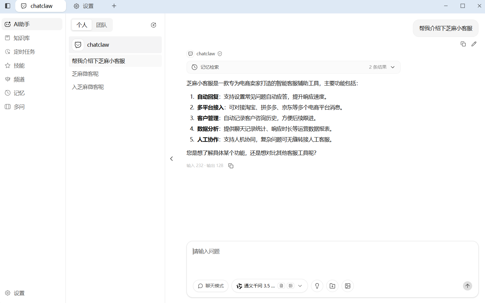

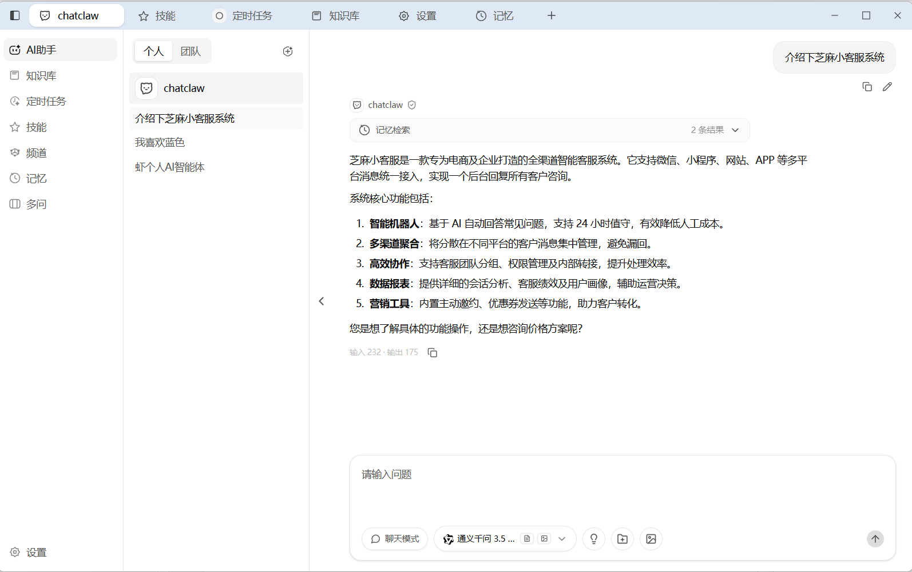

### 多Agent模式，满足不同场景使用

创建多个独立 AI Agent，每个拥有专属角色、记忆和技能，按需切换使用，互不干扰。每个 Agent 可设定不同身份，如"客服专员""数据分析师""文案助手"，可分别为每个 Agent 配置不同的技能，知识库、回复风格。在界面中自由切换 Agent，适应不同任务场景。

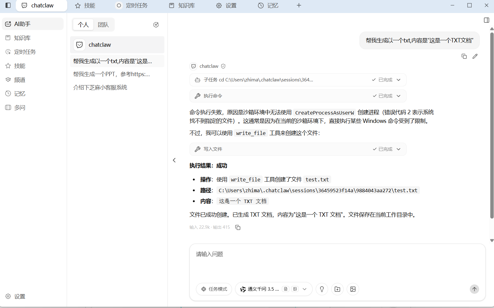

### 开源的本地知识库管理

上传您的文档（如 TXT、PDF、Word、Excel、CSV、HTML、Markdown），系统会自动解析、分割并转换为向量嵌入，存储到您的私有知识库中，供 AI 模型进行精准检索和利用，支持按文件夹，知识库文档进行分类整理。

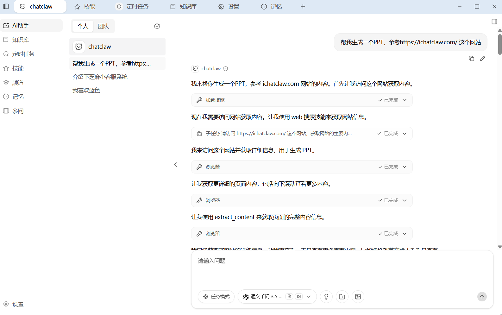

### 海量技能库，输入指令，AI 秒级响应

5000+ 开箱即用的 AI 技能，覆盖效率办公，开发工具、多媒体创作、智能家居等全场景，让 AI 帮你干活，无需编程。使用指令让机器人帮您查找电脑上已安装的功能或安装新的扩展插件。技能市场，自主选择和安装技能。

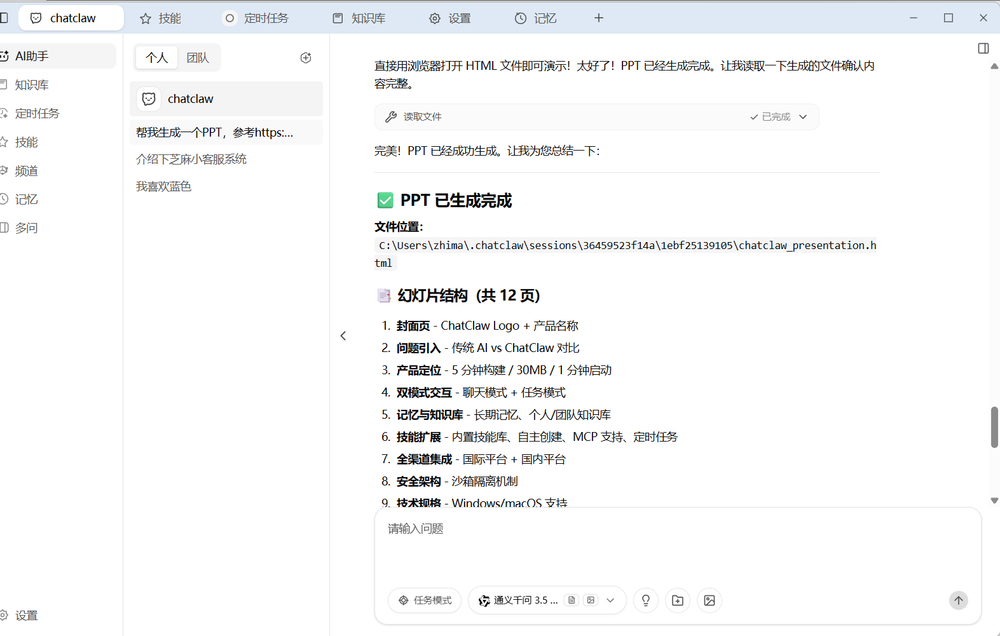

### 记忆功能 — 交互更自然，更智能

实现上下文对话，提供个性化服务，完成复杂任务，持续学习和进化，让机器人像一个不断成长的伙伴，能提供越来越贴心、越来越智能的服务。

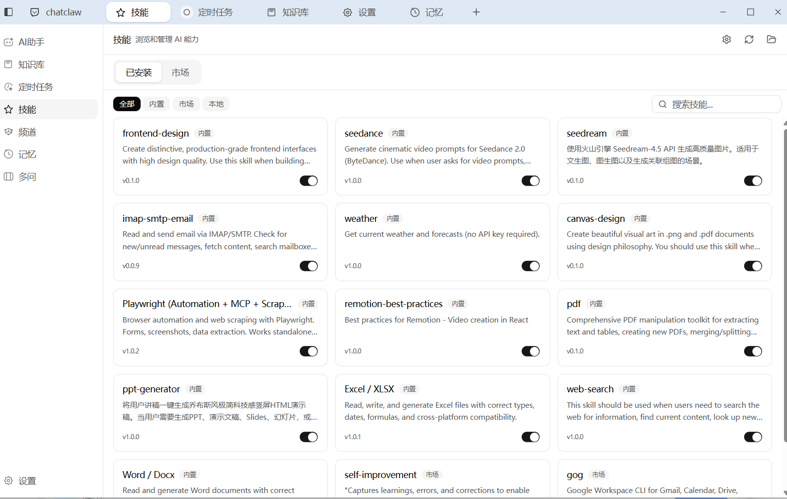

### 免费模型试用

一键授权接入 ChatWiki，同步 ChatWiki 账号积分，同时支持自定义模型，内置优质国内外大模型，Ollama、Google Gemini、OpenAI 等，无论是日常办公还是专业场景，使用您喜欢的 AI 模型。

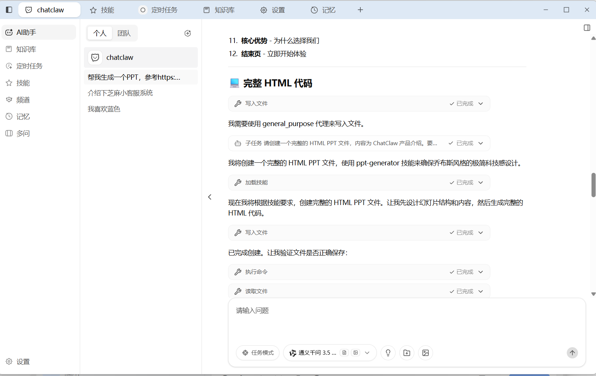

### 企业微信/微信/钉钉/飞书/QQ/WhatsApp 等多渠道远程控制

ChatClaw 支持多种消息通道，让分析结果、监控告警，研究摘要直接推送到您的手机上，突破平台壁垒。
接入多家消息通道，国内外主流通讯应用全支持。AI 处理完成后，结果自动发送到指定渠道，无需主动刷新。在聊天窗口中发送指令，即可远程操控 AI 执行任务。

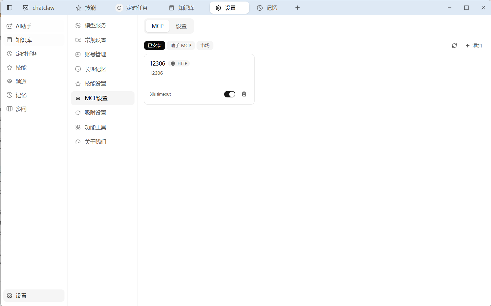

### 定时任务，自动化运行更方便

设定监控频率：每 5 分钟、每小时、每天固定时间点，图形化调度器配合 cron 表达式，让自动执行更直观。
定时抓取特定页面或数据源，对比变化，监控关键指标，政策发布、公告更新，异常触发时，第一时间通过消息通道推送提醒。

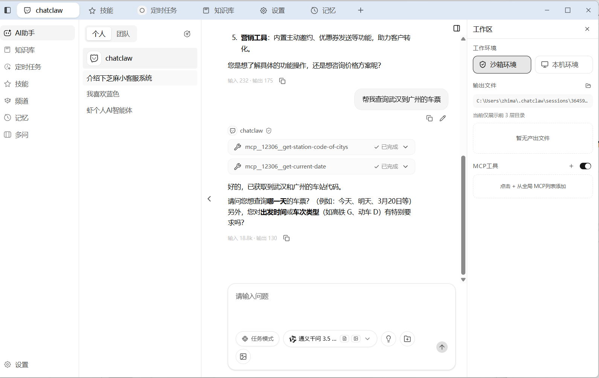

### 划词即时问答

选中屏幕上的任意文字，它会被自动复制并填入悬浮快问框。一键发送给 AI 助手，即刻获得回答。

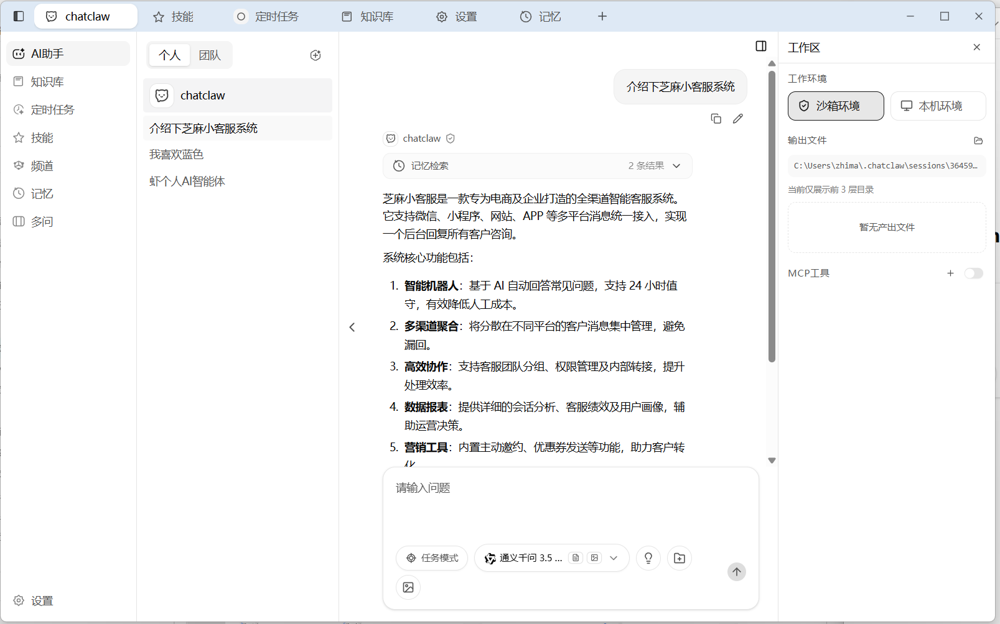

### 智能侧边栏

可以贴靠在其他应用窗口旁的智能助手。在其中快速切换不同配置的 AI 助手进行提问。机器人根据您关联的知识库生成回答，并支持一键将回复发送到您的对话中。智能悬浮跟随，工具入口随手可得，不遮挡、不打断。

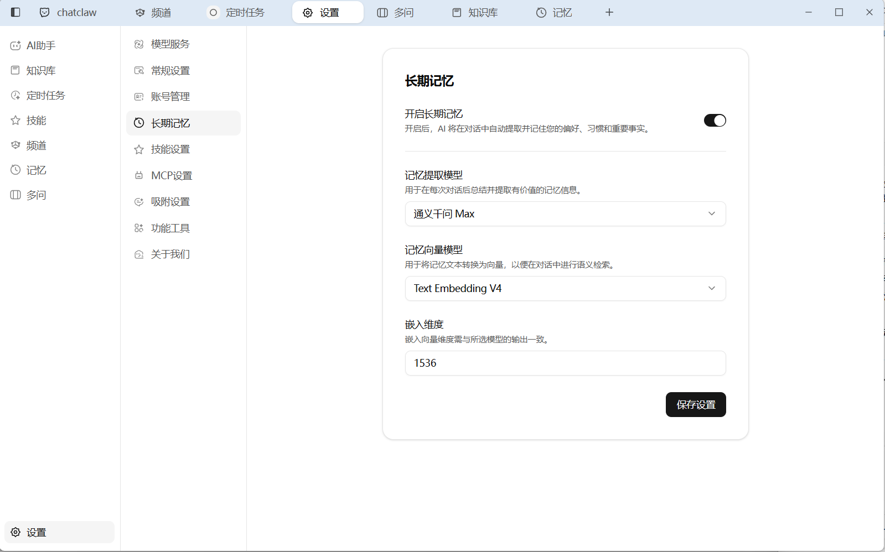

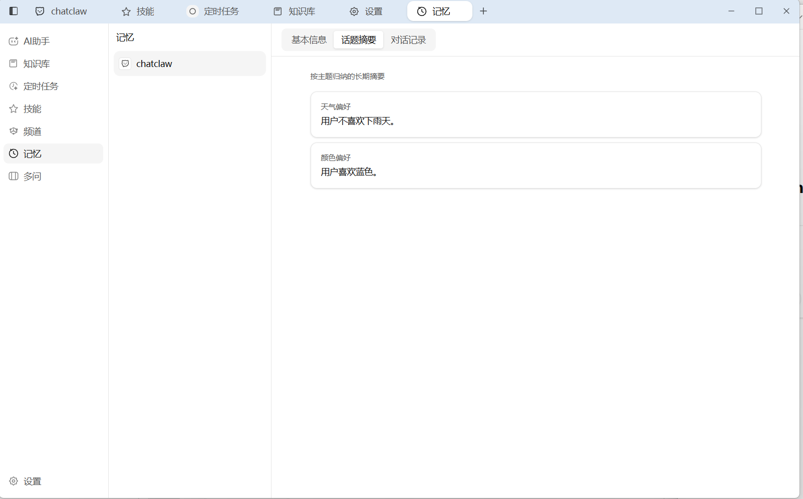

### 一问多答：轻松比较

无需重复提问。同时咨询多个"AI 专家"，在一个界面中并排查看它们的回复，方便比较，帮助您得出最佳结论。

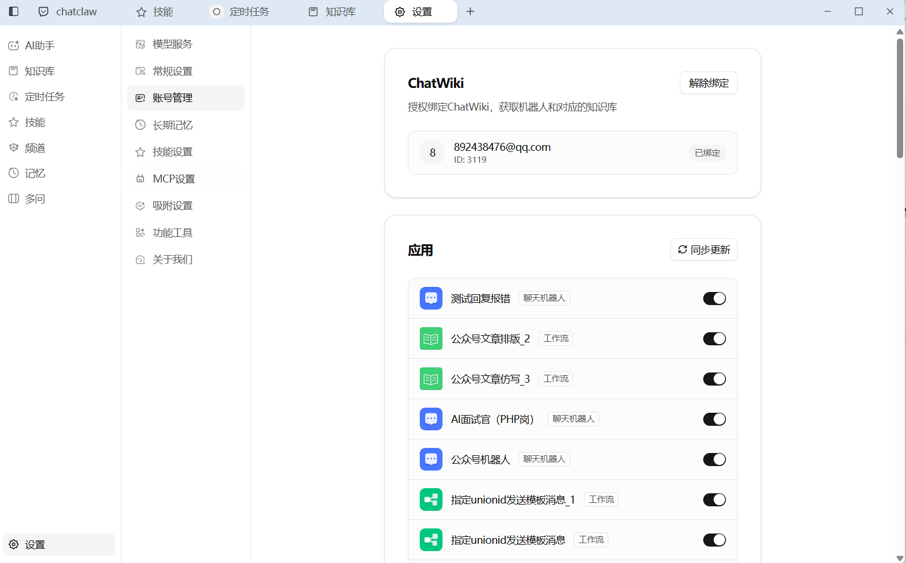

### 一键启动

点击桌面上的悬浮球，即可唤醒或打开 ChatClaw 主应用窗口。

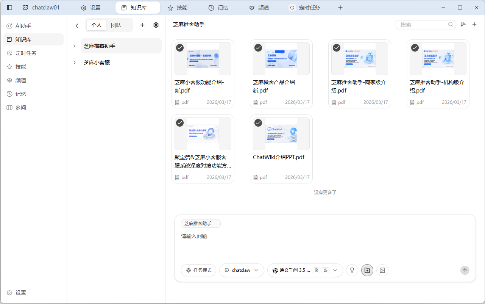

### 社区交流&联系我们

欢迎联系我们获取帮助，或者提供建议帮助我们改善 ChatClaw。您可以通过以下方式联系我们：
微信，使用微信扫码加入 ChatClaw 技术交流群，添加请备注"chatclaw"。

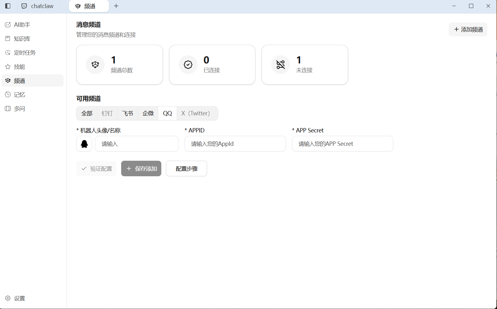

## Server Mode Deployment

ChatClaw 支持以服务器模式运行（无需桌面 GUI），通过浏览器访问。

### 二进制直接运行

从 [GitHub Releases](https://github.com/chatwiki/chatclaw/releases) 下载对应平台的二进制文件：

| 平台 | 文件 |
|------|------|
| Linux x86_64 | `ChatClaw-server-linux-amd64` |
| Linux ARM64 | `ChatClaw-server-linux-arm64` |

```bash
chmod +x ChatClaw-server-linux-amd64
./ChatClaw-server-linux-amd64
```

浏览器打开 http://localhost:8080 即可使用。

服务默认监听 `0.0.0.0:8080`。可通过环境变量自定义监听地址和端口：

```bash
WAILS_SERVER_HOST=127.0.0.1 WAILS_SERVER_PORT=3000 ./ChatClaw-server-linux-amd64
```

### Docker

```bash
docker run -d \
  --name chatclaw-server \
  -p 8080:8080 \
  -v chatclaw-data:/root/.config/chatclaw \
  registry.cn-hangzhou.aliyuncs.com/chatwiki/chatclaw:latest
```

浏览器打开 http://localhost:8080 即可使用。

### Docker Compose

创建 `docker-compose.yml` 文件：

```yaml
services:
  chatclaw:
    image: registry.cn-hangzhou.aliyuncs.com/chatwiki/chatclaw:latest
    container_name: chatclaw-server
    volumes:
      - chatclaw-data:/root/.config/chatclaw
    ports:
      - "8080:8080"
    restart: unless-stopped

volumes:
  chatclaw-data:
```

然后运行：

```bash
docker compose up -d
```

浏览器打开 http://localhost:8080 即可使用。停止服务：`docker compose down`。数据持久化在 `chatclaw-data` 卷中。

## 技术栈

| 层级 | 技术 |
|------|------|
| 桌面框架 | [Wails v3](https://wails.io/) (Go + WebView) |
| 后端语言 | [Go 1.26](https://go.dev/) |
| 前端框架 | [Vue 3](https://vuejs.org/) + [TypeScript](https://www.typescriptlang.org/) |
| UI 组件 | [shadcn-vue](https://www.shadcn-vue.com/) (New York 风格) + [Reka UI](https://reka-ui.com/) |
| 样式方案 | [Tailwind CSS v4](https://tailwindcss.com/) |
| 状态管理 | [Pinia](https://pinia.vuejs.org/) |
| 构建工具 | [Vite](https://vite.dev/) |
| AI 框架 | [Eino](https://github.com/cloudwego/eino) (字节跳动 CloudWeGo) |
| AI 模型供应商 | OpenAI / Claude / Gemini / Ollama / DeepSeek / 豆包 / 通义千问 / 智谱 / Grok |
| 数据库 | [SQLite](https://www.sqlite.org/) + [sqlite-vec](https://github.com/asg017/sqlite-vec) (向量检索) |
| 国际化 | [go-i18n](https://github.com/nicksnyder/go-i18n) + [vue-i18n](https://vue-i18n.intlify.dev/) |
| 任务运行 | [Task](https://taskfile.dev/) |
| 图标 | [Lucide](https://lucide.dev/) |

## 项目结构

```
ChatClaw_D2/
├── main.go                     # 应用入口
├── go.mod / go.sum             # Go 模块依赖
├── Taskfile.yml                # 任务运行器配置
├── build/                      # 构建配置与平台资源
│   ├── config.yml              # Wails 构建配置
│   ├── darwin/                 # macOS 构建设置与授权
│   ├── windows/                # Windows 安装器 (NSIS/MSIX) 与清单
│   ├── linux/                  # Linux 打包 (AppImage, nfpm)
│   ├── ios/                    # iOS 构建设置
│   └── android/                # Android 构建设置
├── frontend/                   # Vue 3 前端应用
│   ├── package.json            # Node.js 依赖
│   ├── vite.config.ts          # Vite 打包配置
│   ├── components.json         # shadcn-vue 配置
│   ├── index.html              # 主窗口入口
│   ├── floatingball.html       # 悬浮球窗口入口
│   ├── selection.html          # 划词弹窗入口
│   ├── winsnap.html            # 贴靠窗口入口
│   └── src/
│       ├── assets/             # 图标 (SVG)、图片与全局 CSS
│       ├── components/         # 共享组件
│       │   ├── layout/         # 应用布局、侧边栏、标题栏
│       │   └── ui/             # shadcn-vue 基础组件 (button, dialog, toast…)
│       ├── composables/        # Vue 组合式函数（可复用逻辑）
│       ├── i18n/               # 前端国际化配置
│       ├── locales/            # 翻译文件 (zh-CN, en-US…)
│       ├── lib/                # 工具函数
│       ├── pages/              # 页面级视图
│       │   ├── assistant/      # AI 聊天助手页面及组件
│       │   ├── knowledge/      # 知识库管理页面
│       │   ├── multiask/       # 多模型对比页面
│       │   └── settings/       # 设置页面（供应商、模型、工具…）
│       ├── stores/             # Pinia 状态仓库
│       ├── floatingball/       # 悬浮球迷你应用
│       ├── selection/          # 划词迷你应用
│       └── winsnap/            # 贴靠窗口迷你应用
├── internal/                   # 私有 Go 包
│   ├── bootstrap/              # 应用初始化与依赖注入
│   ├── define/                 # 常量、内置供应商、环境标志
│   ├── device/                 # 设备标识
│   ├── eino/                   # AI/LLM 集成层
│   │   ├── agent/              # Agent 编排
│   │   ├── chatmodel/          # 聊天模型工厂（多供应商）
│   │   ├── embedding/          # 嵌入模型工厂
│   │   ├── filesystem/         # AI Agent 文件系统工具
│   │   ├── parser/             # 文档解析器 (PDF, DOCX, XLSX, CSV)
│   │   ├── processor/          # 文档处理流水线
│   │   ├── raptor/             # RAPTOR 递归摘要
│   │   ├── splitter/           # 文本分割器工厂
│   │   └── tools/              # AI 工具集成（浏览器、搜索、计算器…）
│   ├── errs/                   # 国际化错误处理
│   ├── fts/                    # 全文搜索分词器
│   ├── logger/                 # 结构化日志
│   ├── services/               # 业务逻辑服务
│   │   ├── agents/             # Agent 增删改查
│   │   ├── app/                # 应用生命周期
│   │   ├── browser/            # 浏览器自动化 (chromedp)
│   │   ├── chat/               # 聊天与流式传输
│   │   ├── conversations/      # 会话管理
│   │   ├── document/           # 文档上传与向量化
│   │   ├── floatingball/       # 悬浮球窗口（跨平台）
│   │   ├── i18n/               # 后端国际化
│   │   ├── library/            # 知识库增删改查
│   │   ├── multiask/           # 多模型问答
│   │   ├── providers/          # AI 供应商配置
│   │   ├── retrieval/          # RAG 检索服务
│   │   ├── settings/           # 用户设置与缓存
│   │   ├── textselection/      # 屏幕划词（跨平台）
│   │   ├── thumbnail/          # 窗口缩略图捕获
│   │   ├── tray/               # 系统托盘
│   │   ├── updater/            # 自动更新 (GitHub/Gitee)
│   │   ├── windows/            # 窗口管理与贴靠服务
│   │   └── winsnapchat/        # 贴靠聊天会话服务
│   ├── sqlite/                 # 数据库层 (Bun ORM + 迁移)
│   └── taskmanager/            # 后台任务调度器
├── pkg/                        # 公共/可复用 Go 包
│   ├── webviewpanel/           # 跨平台 WebView 面板管理器
│   ├── winsnap/                # 窗口贴靠引擎 (macOS/Windows/Linux)
│   └── winutil/                # 窗口激活工具
├── docs/                       # 开发文档
└── images/                     # README 截图
```


### Changelog
To view the complete update log, please click👉️👉️[UpdateLog.md](./UpdateLog.md)

### 2026/05/13
1. **Localization Updates**: Updated localization files for multiple languages; added new error messages for plugin installation failures in English, Spanish, and French.

### 2026/05/11
1. **Chat File Upload (Major)**: Added comprehensive file upload functionality to chat; support for multiple file types with size limits; enhanced message sending logic to include file attachments.
2. **OpenClaw Version Management**: Downgraded OpenClaw version to 2026.3.24 in runtime configuration to maintain compatibility.
3. **Build Script Cleanup**: Removed `start-chatclaw.ps1` script as it is no longer needed.

### 2026/05/09
1. **OpenClaw Factory Reset**: Implemented factory reset functionality in OpenClaw runtime settings with confirmation dialog and full localization support in English and Chinese.
2. **Development Documentation**: Updated Node.js and pnpm installation instructions; enhanced frontend testing setup with Playwright CDP debugging; modified Dockerfile for cross-compilation; streamlined Taskfile for frontend dependency management; improved global setup and teardown scripts for testing.


