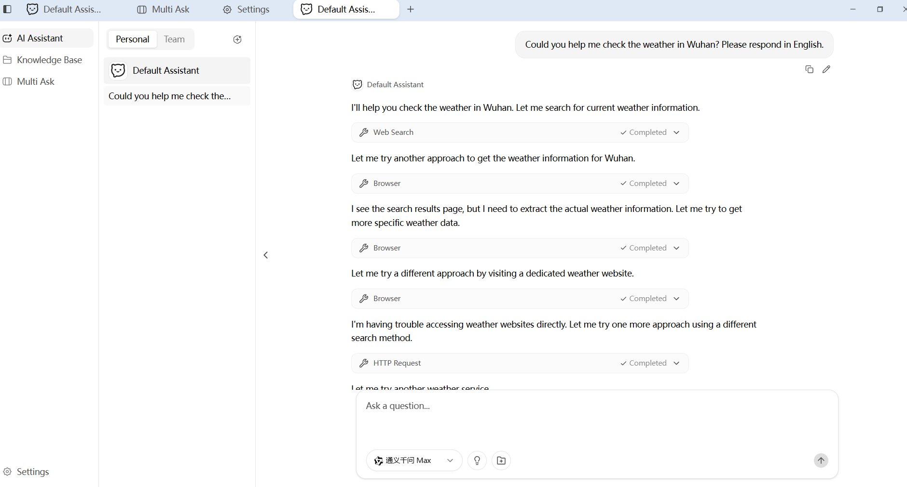
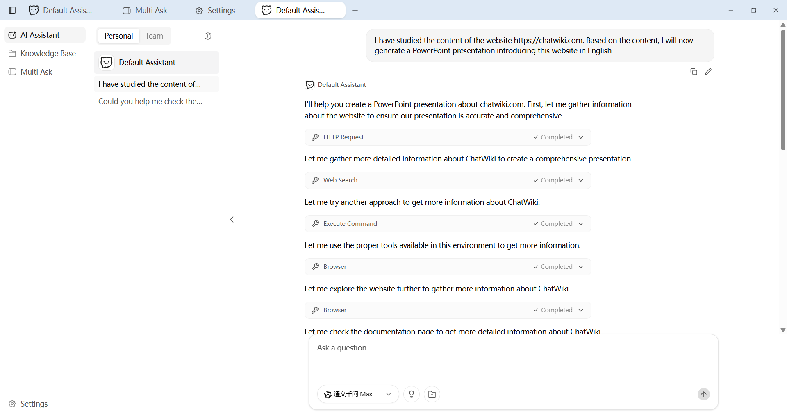
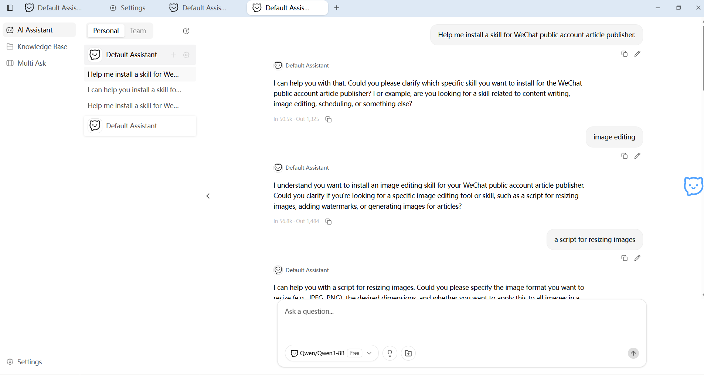
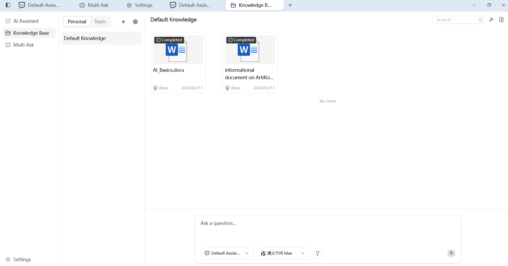
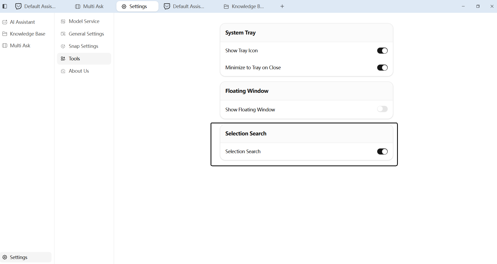
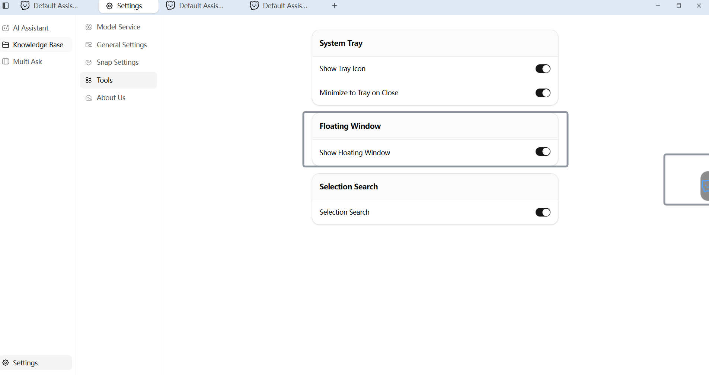

<p align="center">

</p>

<h1 align="center">ChatClaw</h1>

<p align="center">
  <strong>5 Dianam meH OpenClaw nebs retlh AI pagh. Sandbox security, chotlh vIlegh</strong>
</p>

<p align="center">
  <a href="../../README.md">English</a> |
  <a href="README_zh-CN.md">简体中文</a> |
  <a href="README_zh-TW.md">繁體中文</a> |
  <a href="README_ja-JP.md">日本語</a> |
  <a href="README_ko-KR.md">한국어</a> |
  <a href="README_ar-SA.md">العربية</a> |
  <a href="README_bn-BD.md">বাংলা</a> |
  <a href="README_de-DE.md">Deutsch</a> |
  <a href="README_es-ES.md">Español</a> |
  <a href="README_fr-FR.md">Français</a> |
  <a href="README_hi-IN.md">हिन्दी</a> |
  <a href="README_it-IT.md">Italiano</a> |
  <a href="README_pt-BR.md">Português</a> |
  <a href="README_sl-SI.md">Slovenščina</a> |
  <a href="README_tlh.md">tlhIngan</a> |
  <a href="README_tr-TR.md">Türkçe</a> |
  <a href="README_vi-VN.md">Tiếng Việt</a>
</p>

5 Dianam meH OpenClaw nebs retlh AI pagh. SecuritySandbox, macOS & Windows 30MB yItlhos installa (1 dapam install). WhatsApp, Telegram, Slack, Discord, Gmail, DingTalk, WeChat Work, QQ, Feishu 'ej pong cha wavmey. nebs Skill Market, Knowledge Base, Memory, MCP, Scheduled Tasks. vIchel: Go, qap 'ej pong chor. 

## Preview

### AI Chat Assistant

AI Assistant vIHDuv. qajatlh 'e' vIneHDI'pu'. chotlhutlh.



### PPT Quick Generate

智能助理 'o' neSummary command vIHDuva', neH PowerPoint presentation vIchel.



### Skill Manager

命令 vIHDuva', robot vIneHDI'pu' computer vIchel je installation.



### Knowledge Base | Document Vectorization Storage

文档 vIHDuva' (TXT, PDF, Word, Excel, CSV, HTML, Markdown). chotlhutlh vIHDuv je vector embedding, chotlhutlh 'e' vIneHDI'.



### Text Selection Q&A

Screen vIHDuv. chotlhutlh Floating box vIHDuv. AI Assistant 'o' vIneHDI'pu'.




### Smart Snap Window

应用程序 windows vIHDuv. 切换 AI assistants. chotlhutlh 'e' knowledge base vIneHDI'. 点击回复 vIneHDI'.


### Q&A: 比较

问题 vIHDuv. 多专家 vIneHDI'. 并排查看.


### One-Click Launcher Ball

Desktop Floating ball vIHDuv. ChatClaw 主窗口 vIHDuv.



## Server Mode Deployment

ChatClaw server mode vIHDuv (Desktop GUI vIneHbe'). browser vIHDuv.

### Binary

[GitHub Releases](https://github.com/chatwiki/chatclaw/releases):

|| Platform | File |
||----------|------|
|| Linux x86_64 | `ChatClaw-server-linux-amd64` |
|| Linux ARM64 | `ChatClaw-server-linux-arm64` |

```bash
chmod +x ChatClaw-server-linux-amd64
./ChatClaw-server-linux-amd64
```

Browser http://localhost:8080 vIHDuv.

### Docker

```bash
docker run -d \
  --name chatclaw-server \
  -p 8080:8080 \
  -v chatclaw-data:/root/.config/chatclaw \
  registry.cn-hangzhou.aliyuncs.com/chatwiki/chatclaw:latest
```

Browser http://localhost:8080 vIHDuv.

### Docker Compose

```yaml
services:
  chatclaw:
    image: registry.cn-hangzhou.aliyuncs.com/chatwiki/chatclaw:latest
    container_name: chatclaw-server
    volumes:
      - chatclaw-data:/root/.config/chatclaw
    ports:
      - "8080:8080"
    restart: unless-stopped

volumes:
  chatclaw-data:
```

```bash
docker compose up -d
```

## Tech Stack

|| Layer | Technology |
||-------|-----------|
|| Desktop Framework | [Wails v3](https://wails.io/) (Go + WebView) |
|| Backend Language | [Go 1.26](https://go.dev/) |
|| Frontend Framework | [Vue 3](https://vuejs.org/) + [TypeScript](https://www.typescriptlang.org/) |
|| UI Components | [shadcn-vue](https://www.shadcn-vue.com/) + [Reka UI](https://reka-ui.com/) |
|| Styling | [Tailwind CSS v4](https://tailwindcss.com/) |
|| State Management | [Pinia](https://pinia.vuejs.org/) |
|| Build Tool | [Vite](https://vite.dev/) |
|| AI Framework | [Eino](https://github.com/cloudwego/eino) |
|| AI Model Providers | OpenAI / Claude / Gemini / Ollama / DeepSeek / Doubao / Qwen / Zhipu / Grok |
|| Database | [SQLite](https://www.sqlite.org/) + [sqlite-vec](https://github.com/asg017/sqlite-vec) |
|| Internationalization | [go-i18n](https://github.com/nicksnyder/go-i18n) + [vue-i18n](https://vue-i18n.intlify.dev/) |
|| Task Runner | [Task](https://taskfile.dev/) |
|| Icons | [Lucide](https://lucide.dev/) |
