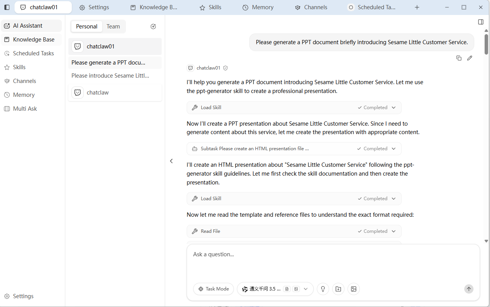
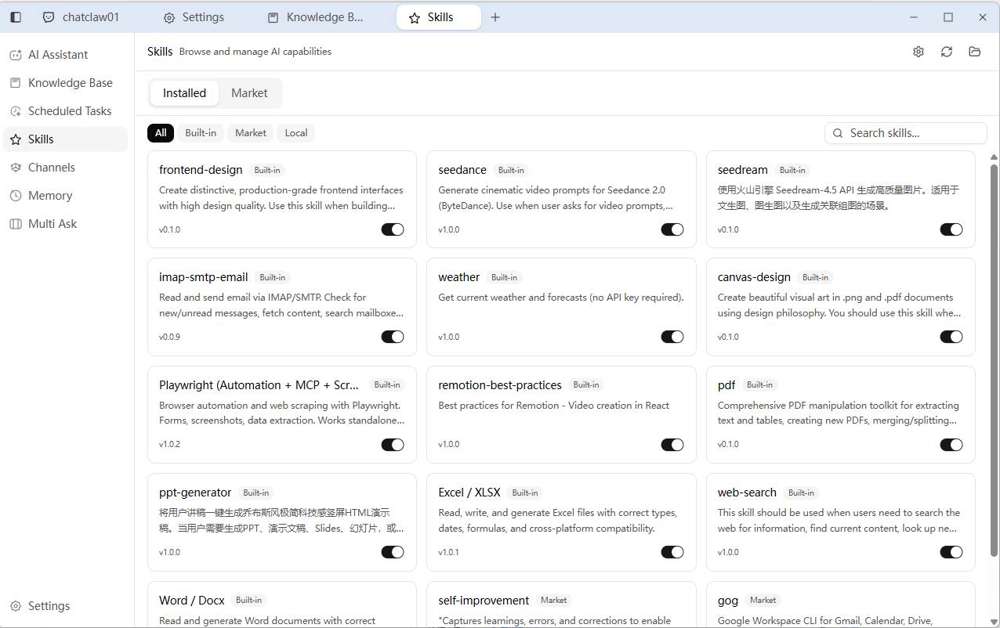
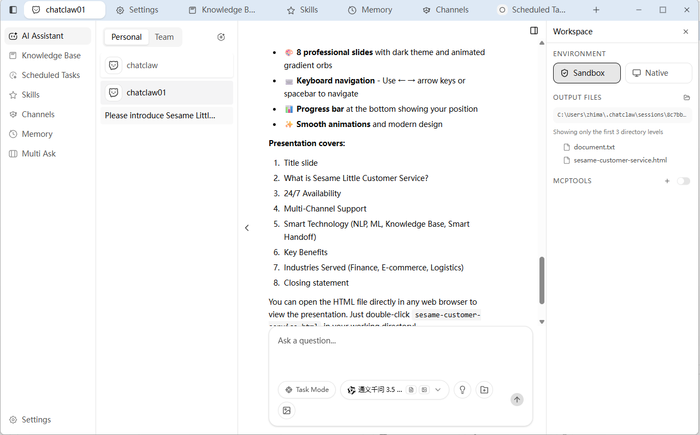
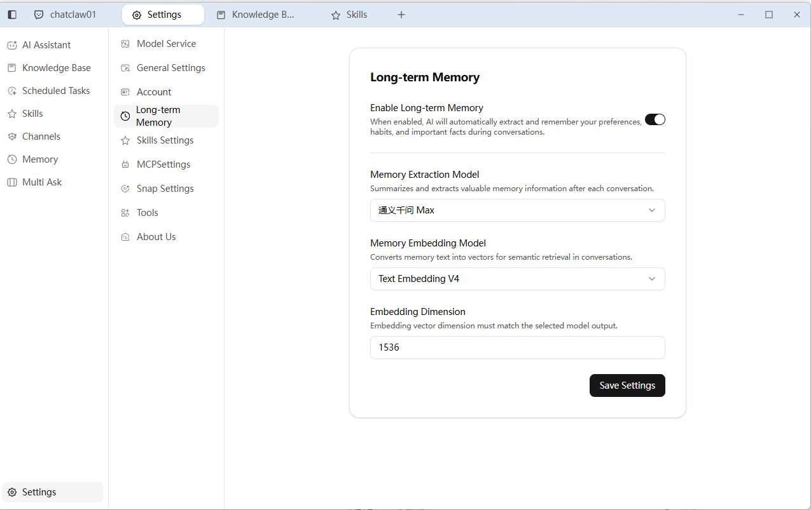
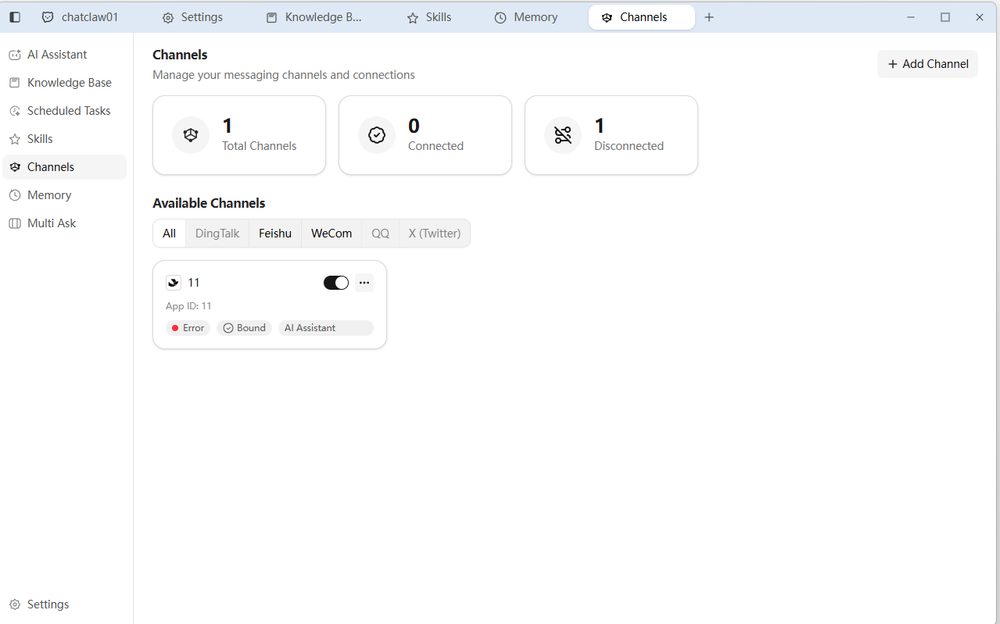
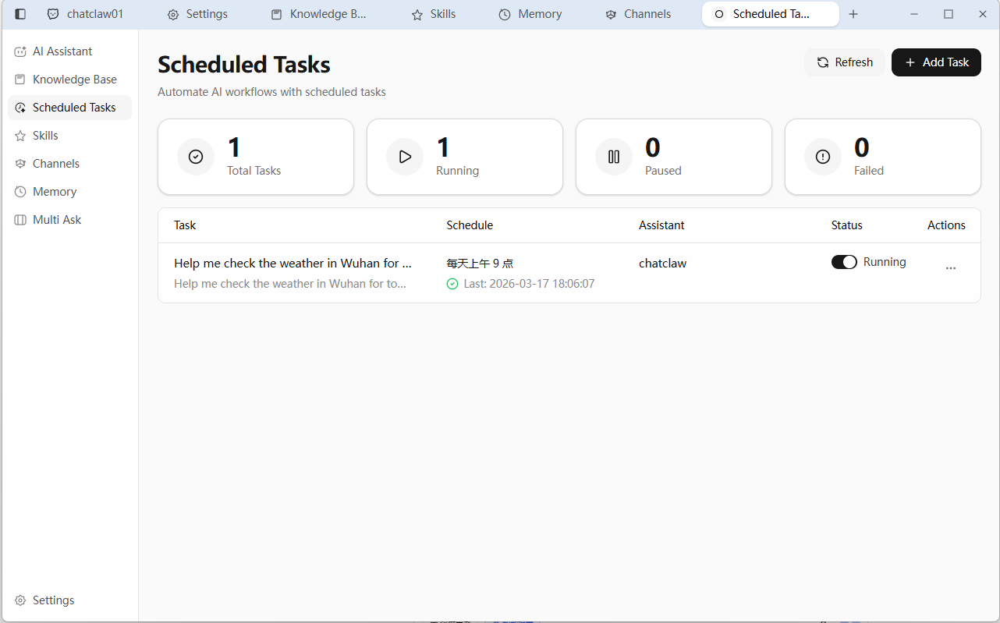
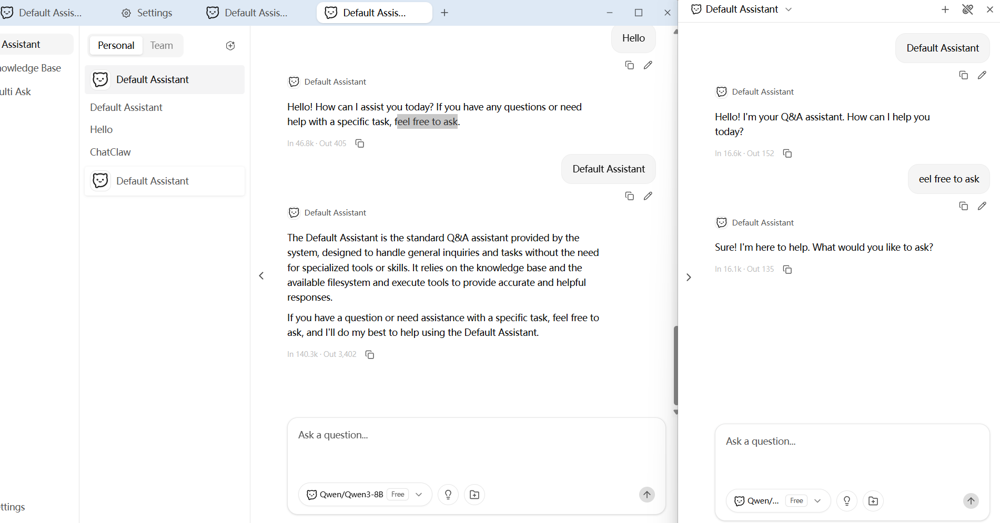
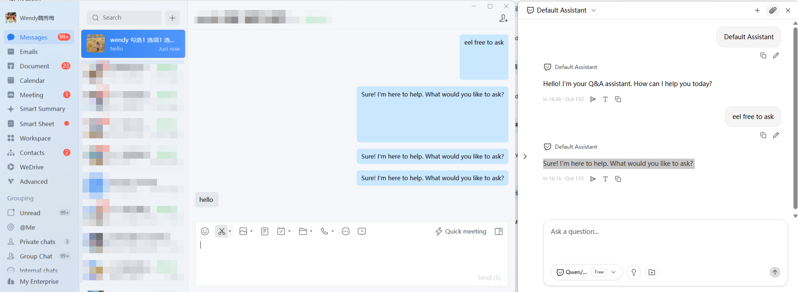
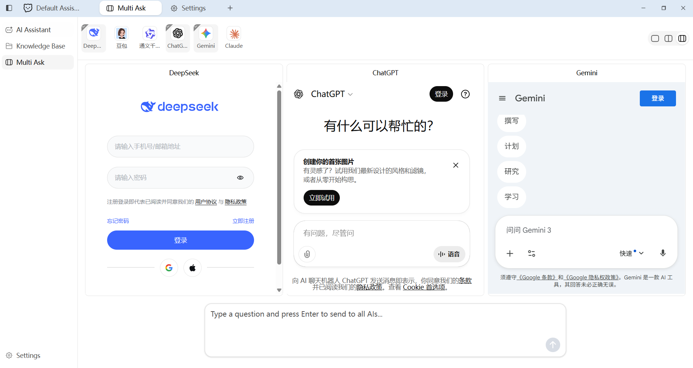
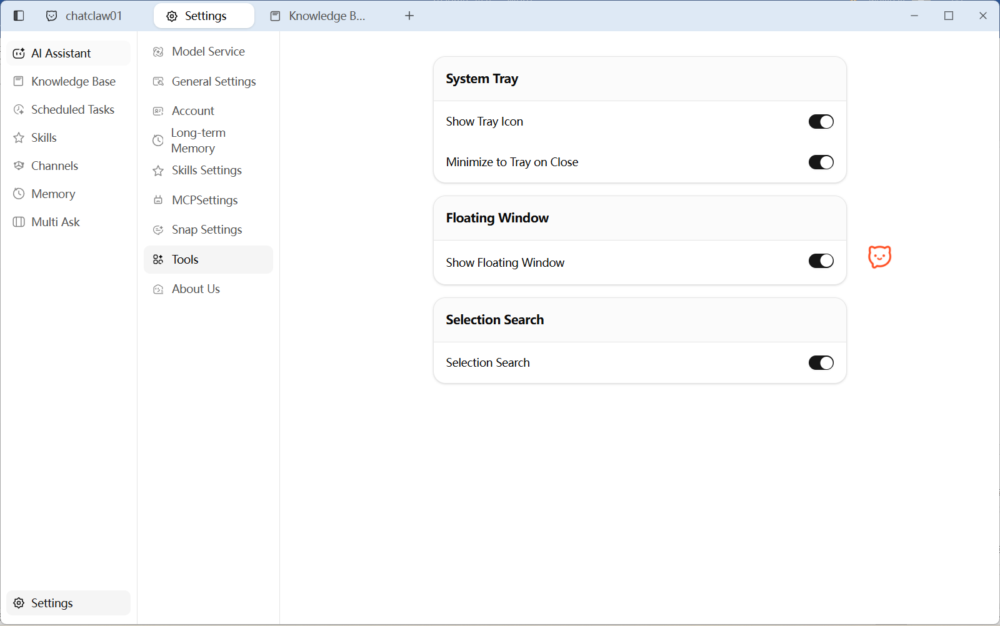

<p align="center">

</p>

<h1 align="center">ChatClaw</h1>

<p align="center">
  <strong>5 মিনিটে OpenClaw-এর মতো ব্যক্তিগত AI এজেন্ট পান। স্যান্ডবক্স সুরক্ষা, ছোট এবং দ্রুত</strong>
</p>

<p align="center">
  <a href="../../README.md">English</a> |
  <a href="README_zh-CN.md">简体中文</a> |
  <a href="README_zh-TW.md">繁體中文</a> |
  <a href="README_ja-JP.md">日本語</a> |
  <a href="README_ko-KR.md">한국어</a> |
  <a href="README_ar-SA.md">العربية</a> |
  <a href="README_bn-BD.md">বাংলা</a> |
  <a href="README_de-DE.md">Deutsch</a> |
  <a href="README_es-ES.md">Español</a> |
  <a href="README_fr-FR.md">Français</a> |
  <a href="README_hi-IN.md">हिन्दी</a> |
  <a href="README_it-IT.md">Italiano</a> |
  <a href="README_pt-BR.md">Português</a> |
  <a href="README_sl-SI.md">Slovenščina</a> |
  <a href="README_tr-TR.md">Türkçe</a> |
  <a href="README_vi-VN.md">Tiếng Việt</a>
</p>

5 মিনিটে OpenClaw-এর মতো ব্যক্তিগত AI এজেন্ট পান। স্যান্ডবক্স সুরক্তিসহ, macOS এবং Windows-এর জন্য অতিরিক্ত ছোট 30MB ইনস্টলার (1 মিনিটে ইনস্টল)। WhatsApp, Telegram, Slack, Discord, Gmail, DingTalk, WeChat Work, QQ, Feishu এবং অন্যান্য মেসেজিং অ্যাপের সাথে সংযুক্ত। বিল্ট-ইন স্কিল মার্কেট, নলেজ বেস, মেমোরি, MCP, শিডিউলড টাস্ক। Go-তে ডেভেলপড: দ্রুত এবং কম রিসোর্স ব্যবহার।

## প্রিভিউ

### AI চ্যাট অ্যাসিস্টেন্ট

আপনার AI অ্যাসিস্টেন্টকে যেকোনো প্রশ্ন করুন; এটি আপনার নলেজ বেস থেকে প্রাসঙ্গিক উত্তর তৈরি করতে বুদ্ধিমানভাবে অনুসন্ধান করবে।


### PPT দ্রুত তৈরি

স্মার্ট অ্যাসিস্টেন্টে একটি বাক্যের কমান্ড পাঠান এবং স্বয়ংক্রিয়ভাবে PowerPoint প্রেজেন্টেশন তৈরি ও জেনারেট করুন।



### স্কিল ম্যানেজার

কমান্ড ব্যবহার করে অ্যাসিস্টেন্টকে আপনার কম্পিউটারে ইনস্টল করা ফিচার খুঁজে বের করতে বা নতুন এক্সটেনশন প্লাগইন ইনস্টল করতে সাহায্য করুন।



### MCP: সীমাহীন ক্ষমতা সম্প্রসারণ

বিভিন্ন ডেটা সোর্স ও টুলের সাথে নিরাপদ ও দক্ষভাবে সংযোগের জন্য বাহ্যিক MCP সার্ভার যোগ করুন; আপনার অ্যাসিস্টেন্ট দৈনন্দিন কাজ থেকে পেশাদার ওয়ার্কফ্লোতে এগিয়ে যাবে।


### স্যান্ডবক্স মোড: দ্বৈত সুরক্ষা

স্যান্ডবক্স-আইসোলেটেড এক্সিকিউশন (OS-লেভেল আইসোলেশন, সীমিত কমান্ড স্কোপ) এবং নেটিভ এক্সিকিউশন (আরও নমনীয়) এর মধ্যে বেছে নিন। নিরাপত্তা ও সুবিধার ভারসাম্যের জন্য স্বাধীনভাবে স্যুইচ করুন।



### মেমরি: আরও প্রাকৃতিক, আরও স্মার্ট ইন্টারঅ্যাকশন

প্রাসঙ্গিক কথোপকথন ও ব্যক্তিগত সহায়তা সক্ষম করুন। অ্যাসিস্টেন্ট ক্রমাগত শিখতে ও বিকশিত হতে পারে যেমন একটি বেড়ে ওঠা অংশীদার।



### শেয়ার্ড টিম নলেজ বেস

রোবট ও নলেজ বেস সিঙ্ক, কনফিগ শেয়ার এবং সদস্য পারমিশন নিয়ন্ত্রণের জন্য ChatWiki-এ ওয়ান-ক্লিক অ্যাক্সেস অথোরাইজ করুন।


### নলেজ বেস | ডকুমেন্ট ভেক্টরাইজেশন স্টোরেজ

ডকুমেন্ট আপলোড করুন (TXT, PDF, Word, Excel, CSV, HTML, Markdown)। সিস্টেম স্বয়ংক্রিয়ভাবে পার্স, স্প্লিট এবং ভেক্টর এম্বেডিংয়ে রূপান্তর করে সুনির্দিষ্ট রিট্রিভালের জন্য।


### রিচ IM চ্যানেল ইন্টিগ্রেশন

SDK-এর মাধ্যমে IM প্রোভাইডার (Feishu, WeCom, QQ, DingTalk, LINE, Discord, WhatsApp, X/Twitter, Telegram ইত্যাদি) ইন্টিগ্রেট করে দ্রুত চ্যানেল ক্রিয়েশন, ইউজার ম্যানেজমেন্ট ও মেসেজিং সক্ষম করুন।



### শিডিউলড টাস্ক

প্রিসেট সময় বা ব্যবধানে রিমাইন্ডার, পুনরাবৃত্ত কাজ ও সিস্টেম-লেভেল মেইনটেন্যান্সের জন্য অ্যাসিস্টেন্টকে স্বয়ংক্রিয়ভাবে অ্যাকশন চালাতে দিন।



### ইনস্ট্যান্ট Q&A-এর জন্য টেক্সট সিলেকশন

স্ক্রিনে যেকোনো টেক্সট সিলেক্ট করুন; এটি স্বয়ংক্রিয়ভাবে ফ্লোটিং কুইক-আস্ক বক্সে কপি হয়। এক ক্লিকে জিজ্ঞাসা করুন, তাৎক্ষণিক উত্তর।




### স্মার্ট সাইডবার

অ্যাসিস্টেন্টকে অন্যান্য উইন্ডোর পাশে স্ন্যাপ করুন, বিভিন্ন কনফিগারড অ্যাসিস্টেন্টের মধ্যে দ্রুত সুইচ করুন এবং আপনার কথোপকথনে জেনারেটেড রিপ্লাই ওয়ান-ক্লিকে পাঠান।



### এক প্রশ্ন, একাধিক উত্তর: সহজে তুলনা করুন

একই সাথে একাধিক "AI বিশেষজ্ঞ" পরামর্শ নিন এবং তাদের উত্তর পাশাপাশি দেখুন সহজ তুলনার জন্য।



### ওয়ান-ক্লিক লঞ্চার বল

ChatClaw মেইন উইন্ডো ওয়েক আপ বা ওপেন করতে ডেস্কটপের ফ্লোটিং বলে ক্লিক করুন।



## সার্ভার মোড ডিপ্লয়মেন্ট

ChatClaw সার্ভার মোডে চালানো যায় (ডেস্কটপ GUI প্রয়োজন নেই), ব্রাউজারের মাধ্যমে অ্যাক্সেসযোগ্য।

### বাইনারি সরাসরি রান

আপনার প্ল্যাটফর্মের জন্য বাইনারি [GitHub Releases](https://github.com/chatwiki/chatclaw/releases) থেকে ডাউনলোড করুন:

|| প্ল্যাটফর্ম | ফাইল |
||----------|------|
|| Linux x86_64 | `ChatClaw-server-linux-amd64` |
|| Linux ARM64 | `ChatClaw-server-linux-arm64` |

```bash
chmod +x ChatClaw-server-linux-amd64
./ChatClaw-server-linux-amd64
```

আপনার ব্রাউজারে http://localhost:8080 খুলুন।

সার্ভার ডিফল্টভাবে `0.0.0.0:8080` এ শোনে। আপনি এনভায়রনমেন্ট ভেরিয়েবলের মাধ্যমে হোস্ট এবং পোর্ট কাস্টমাইজ করতে পারেন:

```bash
WAILS_SERVER_HOST=127.0.0.1 WAILS_SERVER_PORT=3000 ./ChatClaw-server-linux-amd64
```

### Docker

```bash
docker run -d \
  --name chatclaw-server \
  -p 8080:8080 \
  -v chatclaw-data:/root/.config/chatclaw \
  registry.cn-hangzhou.aliyuncs.com/chatwiki/chatclaw:latest
```

আপনার ব্রাউজারে http://localhost:8080 খুলুন।

### Docker Compose

একটি `docker-compose.yml` ফাইল তৈরি করুন:

```yaml
services:
  chatclaw:
    image: registry.cn-hangzhou.aliyuncs.com/chatwiki/chatclaw:latest
    container_name: chatclaw-server
    volumes:
      - chatclaw-data:/root/.config/chatclaw
    ports:
      - "8080:8080"
    restart: unless-stopped

volumes:
  chatclaw-data:
```

তারপর রান করুন:

```bash
docker compose up -d
```

আপনার ব্রাউজারে http://localhost:8080 খুলুন। থামাতে: `docker compose down`। ডেটা `chatclaw-data` ভলিউমে স্থায়ী হয়।

## প্রযুক্তি স্ট্যাক

|| লেয়ার | প্রযুক্তি |
||-------|-----------|
|| ডেস্কটপ ফ্রেমওয়ার্ক | [Wails v3](https://wails.io/) (Go + WebView) |
|| ব্যাকএন্ড ভাষা | [Go 1.26](https://go.dev/) |
|| ফ্রন্টএন্ড ফ্রেমওয়ার্ক | [Vue 3](https://vuejs.org/) + [TypeScript](https://www.typescriptlang.org/) |
|| UI কম্পোনেন্ট | [shadcn-vue](https://www.shadcn-vue.com/) + [Reka UI](https://reka-ui.com/) |
|| স্টাইলিং | [Tailwind CSS v4](https://tailwindcss.com/) |
|| স্টেট ম্যানেজমেন্ট | [Pinia](https://pinia.vuejs.org/) |
|| বিল্ড টুল | [Vite](https://vite.dev/) |
|| AI ফ্রেমওয়ার্ক | [Eino](https://github.com/cloudwego/eino) (ByteDance CloudWeGo) |
|| AI মডেল প্রোভাইডার | OpenAI / Claude / Gemini / Ollama / DeepSeek / Doubao / Qwen / Zhipu / Grok |
|| ডাটাবেস | [SQLite](https://www.sqlite.org/) + [sqlite-vec](https://github.com/asg017/sqlite-vec) (ভেক্টর সার্চ) |
|| ইন্টারন্যাশনালাইজেশন | [go-i18n](https://github.com/nicksnyder/go-i18n) + [vue-i18n](https://vue-i18n.intlify.dev/) |
|| টাস্ক রানার | [Task](https://taskfile.dev/) |
|| আইকন | [Lucide](https://lucide.dev/) |

## প্রজেক্ট স্ট্রাকচার

```
ChatClaw_D2/
├── main.go                     # অ্যাপ্লিকেশন এন্ট্রি পয়েন্ট
├── go.mod / go.sum             # Go মডিউল ডিপেন্ডেন্সি
├── Taskfile.yml                # টাস্ক রানার কনফিগারেশন
├── build/                      # বিল্ড কনফিগারেশন এবং প্ল্যাটফর্ম অ্যাসেট
│   ├── config.yml              # Wails বিল্ড কনফিগারেশন
│   ├── darwin/                 # macOS বিল্ড সেটিংস এবং এন্টাইটেলমেন্টস
│   ├── windows/                # Windows ইনস্টলার (NSIS/MSIX) এবং ম্যানিফেস্ট
│   ├── linux/                  # Linux প্যাকেজিং (AppImage, nfpm)
│   ├── ios/                    # iOS বিল্ড সেটিংস
│   └── android:                # Android বিল্ড সেটিংস
├── frontend:                   # Vue 3 ফ্রন্টএন্ড অ্যাপ্লিকেশন
│   ├── package.json            # Node.js ডিপেন্ডেন্সি
│   ├── vite.config.ts          # Vite বান্ডলার কনফিগারেশন
│   ├── components.json         # shadcn-vue কনফিগারেশন
│   ├── index.html              # মূল উইন্ডো এন্ট্রি
│   ├── floatingball.html       # ফ্লোটিং বল উইন্ডো এন্ট্রি
│   ├── selection.html          # টেক্সট সিলেকশন পপআপ এন্ট্রি
│   ├── winsnap.html            # স্ন্যাপ উইন্ডো এন্ট্রি
│   └── src/
│       ├── assets/             # আইকন (SVG), ছবি এবং গ্লোবাল CSS
│       ├── components/         # শেয়ার্ড কম্পোনেন্ট
│       │   ├── layout/         # অ্যাপ লেআউট, সাইডবার, টাইটেলবার
│       │   └── ui:             # shadcn-vue প্রিমিটিভস (button, dialog, toast…)
│       ├── composables:        # Vue composables (রিইউজেবল লজিক)
│       ├── i18n:               # ফ্রন্টএন্ড i18n সেটআপ
│       ├── locales:            # ট্রান্সলেশন ফাইল (zh-CN, en-US…)
│       ├── lib:                # ইউটিলিটি ফাংশন
│       ├── pages:              # পেজ-লেভেল ভিউ
│       │   ├── assistant:      # AI চ্যাট অ্যাসিস্টেন্ট পেজ এবং কম্পোনেন্ট
│       │   ├── knowledge:      # নলেজ বেস ম্যানেজমেন্ট পেজ
│       │   ├── multiask:       # মাল্টি-মডেল তুলনা পেজ
│       │   └── settings:       # সেটিংস পেজ (প্রোভাইডার, মডেল, টুলস…)
│       ├── stores:             # Pinia স্টেট স্টোর
│       ├── floatingball:       # ফ্লোটিং বল মিনি-অ্যাপ
│       ├── selection:          # টেক্সট সিলেকশন মিনি-অ্যাপ
│       └── winsnap:            # স্ন্যাপ উইন্ডো মিনি-অ্যাপ
├── internal:                   # প্রাইভেট Go প্যাকেজ
│   ├── bootstrap:              # অ্যাপ্লিকেশন ইনিশিয়ালাইজেশন এবং ওয়ারিং
│   ├── define:                 # কনস্ট্যান্টস, বিল্ট-ইন প্রোভাইডার, এনভ ফ্ল্যাগ
│   ├── device:                 # ডিভাইস আইডেন্টিফিকেশন
│   ├── eino:                   # AI/LLM ইন্টিগ্রেশন লেয়ার
│   │   ├── agent:              # এজেন্ট অর্কেস্ট্রেশন
│   │   ├── chatmodel:          # চ্যাট মডেল ফ্যাক্টরি (মাল্টি-প্রোভাইডার)
│   │   ├── embedding:          # এম্বেডিং মডেল ফ্যাক্টরি
│   │   ├── filesystem:         # AI Agent ফাইলসিস্টেম টুলস
│   │   ├── parser:             # ডকুমেন্ট পার্সার (PDF, DOCX, XLSX, CSV)
│   │   ├── processor:          # ডকুমেন্ট প্রসেসিং পাইপলাইন
│   │   ├── raptor:             # RAPTOR রিকার্সিভ সামারাইজেশন
│   │   ├── splitter:           # টেক্সট স্প্লিটার ফ্যাক্টরি
│   │   └── tools:              # AI টুল ইন্টিগ্রেশন (ব্রাউজার, সার্চ, ক্যালকুলেটর…)
│   ├── errs:                   # i18n-অ্যাওয়্যার এরর হ্যান্ডলিং
│   ├── fts:                    # ফুল-টেক্সট সার্চ টোকেনাইজার
│   ├── logger:                 # স্ট্রাকচার্ড লগিং
│   ├── services:               # বিজনেস লজিক সার্ভিস
│   │   ├── agents:             # Agent CRUD
│   │   ├── app:                # অ্যাপ্লিকেশন লাইফসাইকেল
│   │   ├── browser:            # ব্রাউজার অটোমেশন (chromedp)
│   │   ├── chat:               # চ্যাট এবং স্ট্রিমিং
│   │   ├── conversations:      # কভারসেশন ম্যানেজমেন্ট
│   │   ├── document:           # ডকুমেন্ট আপলোড এবং ভেক্টরাইজেশন
│   │   ├── floatingball:       # ফ্লোটিং বল উইন্ডো (ক্রস-প্ল্যাটফর্ম)
│   │   ├── i18n:               # ব্যাকএন্ড i18n
│   │   ├── library:            # নলেজ লাইব্রেরি CRUD
│   │   ├── multiask:           # মাল্টি-মডেল Q&A
│   │   ├── providers:          # AI প্রোভাইডার কনফিগারেশন
│   │   ├── retrieval:          # RAG রিট্রিভাল সার্ভিস
│   │   ├── settings:           # ইউজার সেটিংস উইথ ক্যাশে
│   │   ├── textselection:      # স্ক্রিন টেক্সট সিলেকশন (ক্রস-প্ল্যাটফর্ম)
│   │   ├── thumbnail:          # উইন্ডো থাম্বনেইল ক্যাপচার
│   │   ├── tray:               # সিস্টেম ট্রে
│   │   ├── updater:            # অটো-আপডেট (GitHub/Gitee)
│   │   ├── windows:            # উইন্ডো ম্যানেজমেন্ট এবং স্ন্যাপ সার্ভিস
│   │   └── winsnapchat:        # স্ন্যাপ চ্যাট সেশন সার্ভিস
│   ├── sqlite:                 # ডাটাবেস লেয়ার (Bun ORM + migrations)
│   └── taskmanager:            # ব্যাকগ্রাউন্ড টাস্ক শিডিউলার
├── pkg:                         # পাবলিক/রিইউজেবল Go প্যাকেজ
│   ├── webviewpanel:           # ক্রস-প্ল্যাটফর্ম WebView প্যানেল ম্যানেজার
│   ├── winsnap:                # উইন্ডো স্ন্যাপ ইঞ্জিন (macOS/Windows/Linux)
│   └── winutil:                # উইন্ডো অ্যাক্টিভেশন ইউটিলিটি
├── docs:                       # ডেভেলপমেন্ট ডকুমেন্টেশন
└── images:                      # README স্ক্রিনশট
```

